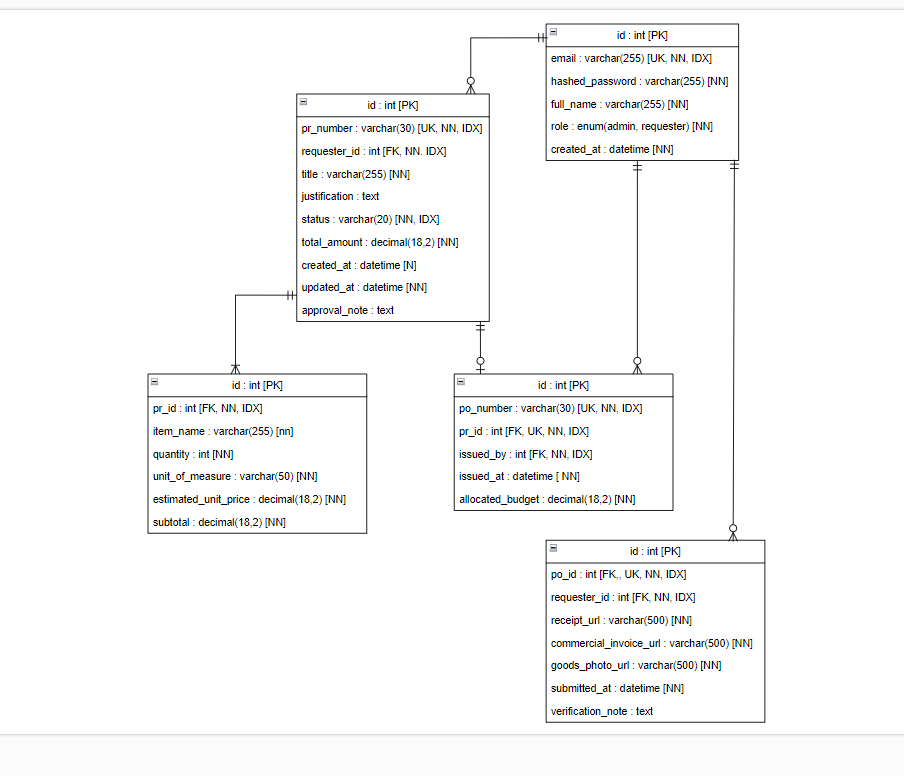

# ☁️ SiCure — Sistem Information Procurement


SiCure (Sistem Information Procurement) merupakan aplikasi berbasis cloud yang dirancang untuk membantu organisasi dalam mengelola proses pengadaan barang/jasa secara digital, terstruktur, dan transparan.

Aplikasi ini mendukung pencatatan serta monitoring proses procurement mulai dari pengajuan hingga verifikasi akhir dalam satu platform terintegrasi. Dengan sistem ini, organisasi seperti himpunan mahasiswa, UKM, maupun komunitas dapat meningkatkan efisiensi administrasi, mengurangi kesalahan pencatatan, serta memastikan transparansi dalam pengelolaan pengadaan.

Melalui pendekatan berbasis cloud, sistem dapat diakses kapan saja dan di mana saja oleh pihak yang berwenang, sehingga mendukung pengambilan keputusan yang lebih cepat dan akurat.

**Backend:** FastAPI + SQLAlchemy (async) + PostgreSQL  
**Frontend:** React 19 + TypeScript + Vite

---

## 🔄 CI/CD Pipeline

Pipeline berjalan otomatis ketika:

- Push ke branch `main`
- Pull Request ke branch `main`

### Tahapan Pipeline

✅ Backend Testing (Pytest)

✅ Frontend Testing (Vitest)

✅ Frontend Build Verification

✅ Docker Image Build

✅ Railway Deployment

### Workflow

```text
Developer Push
       │
       ▼
GitHub Actions
       │
       ├── Backend Test (Pytest)
       ├── Frontend Test (Vitest)
       ├── Docker Build
       └── Railway Deployment
```

## 👥 Tim

| Nama | NIM | Peran |
|------|------|--------|
| Muchlis Wahyu Saputra | 10231054 | Lead Backend |
| Ranaya Chintya Mahitsa | 10231078 | Lead Frontend |
| Andi Adam Firdaus | 10211014 | Lead DevOps |
| Ahmad Baihaqi | 10221063 | Lead DevOps |
| Az-Zahra Atikah Nurhaliza | 10231022 | Lead QA & Docs |

---

## 📌 Fitur Utama Sistem

- **Procurement Management**: Pengajuan hingga persetujuan pengadaan
- **Purchase Order (PO)**: Penerbitan dokumen resmi pembelian
- **GRN (Goods Receipt Note)**: Upload bukti penerimaan barang
- **Verification System**: Validasi dokumen oleh admin
- **Role-Based Access Control**: Hak akses berdasarkan role (Admin & Requester)
- **Audit & Tracking**: Monitoring status setiap proses pengadaan

---

## 🏗️ System Architecture

SiCure menggunakan arsitektur microservices dengan pemisahan layanan berdasarkan domain bisnis.

```text
                    ┌─────────────┐
                    │  Frontend   │
                    │ React + TS  │
                    └──────┬──────┘
                           │
                           ▼
                    ┌─────────────┐
                    │ API Gateway │
                    │    Nginx    │
                    └──────┬──────┘
                           │
          ┌────────────────┴────────────────┐
          ▼                                 ▼
 ┌─────────────────┐             ┌─────────────────┐
 │  Auth Service   │             │ Procurement Svc │
 │ FastAPI         │             │ FastAPI         │
 └────────┬────────┘             └────────┬────────┘
          │                               │
          ▼                               ▼
 ┌─────────────────┐             ┌─────────────────┐
 │   Auth DB       │             │ Procurement DB  │
 │ PostgreSQL 16   │             │ PostgreSQL 16   │
 └─────────────────┘             └─────────────────┘
```

### Komponen

- Frontend (React + TypeScript)
- API Gateway (Nginx)
- Auth Service
- Procurement Service
- Auth Database
- Procurement Database


## Daftar Isi

1. CI/CD Pipeline
2. System Architecture
3. Prasyarat
4. Quick Start (Docker)
5. Setup Backend
6. Setup Frontend
7. Menjalankan Backend & Frontend Bersamaan
8. Credential Demo Login
9. Alur Procurement
10. Struktur Project
11. ERD
12. API Endpoints
13. Scripts
14. Security Features
15. Documentation
16. Catatan Keamanan
17. Next Steps
18. Tech Stack
19. Hasil Pengujian

---

## Prasyarat

| Tool       | Versi   | Keterangan                          |
|------------|---------|-------------------------------------|
| Python     | 3.11+   | Backend runtime                     |
| Node.js    | 20+     | Frontend tooling                    |
| PostgreSQL | 16+     | Database utama                      |
| Git        | 2.x     | Version control                     |

Install sesuai OS masing-masing:

- **Python:** https://www.python.org/downloads/ atau via package manager (`apt`, `brew`, `dnf`, dll.)
- **Node.js:** https://nodejs.org/ atau via [nvm](https://github.com/nvm-sh/nvm)
- **PostgreSQL:** https://www.postgresql.org/download/

```bash
# Verifikasi instalasi
python3 --version   # Python 3.11.x atau lebih baru
node --version      # v20.x.x atau lebih baru
psql --version      # psql (PostgreSQL) 16.x atau lebih baru
```
--- 

## 🐳 Quick Start (Docker)

Menjalankan seluruh sistem menggunakan Docker Compose:

```bash
git clone <repository-url>

cd sicure

cp .env.example .env

docker compose up -d
```

Verifikasi:

```bash
docker ps
```

Akses aplikasi:

| Service | URL |
|----------|------|
| Frontend | http://localhost:5173 |
| API Gateway | http://localhost |
| Swagger Docs | http://localhost/docs |

---

## Setup Backend

```bash
# 1. Masuk ke direktori backend
cd backend

# 2. Buat virtual environment
python3 -m venv venv

# 3. Aktifkan virtual environment
source venv/bin/activate         # Linux/macOS
# venv\Scripts\activate          # Windows

# 4. Install dependencies
pip install -r requirements.txt

# 5. Salin dan edit konfigurasi environment
cp .env.local .env
# Edit .env sesuai konfigurasi database lokal Anda

# 6. Buat database PostgreSQL
createdb sicure_db
# Atau via psql:
# psql -c "CREATE DATABASE sicure_db;"

# 7. Jalankan migrasi database (Alembic)
alembic upgrade head

# 8. Jalankan seeder (buat user demo)
python -m app.seed

# Kembali ke root project
cd ..
```

### Alembic Commands

```bash
# Jalankan semua migrasi
alembic upgrade head

# Rollback 1 step
alembic downgrade -1

# Buat migrasi baru (autogenerate)
alembic revision --autogenerate -m "deskripsi perubahan"

# Lihat status migrasi
alembic current
alembic history
```

---

## Setup Frontend

```bash
# 1. Masuk ke direktori frontend
cd frontend

# 2. Install dependencies
npm install

# 3. Salin dan edit konfigurasi environment
cp .env.local .env
# Default: VITE_API_BASE_URL=http://localhost:8000/api/v1

# Kembali ke root project
cd ..
```

---

## Menjalankan Backend & Frontend Bersamaan

**Terminal 1 — Backend:**
```bash
cd backend
source venv/bin/activate
uvicorn app.main:app --reload --host 0.0.0.0 --port 8000
```

**Terminal 2 — Frontend:**
```bash
cd frontend
npm run dev
```
---

## Credential Demo Login

Setelah menjalankan `npm run db:seed` atau `python -m app.seed`, user berikut tersedia:

| Email                    | Password         | Role        | Nama            |
|--------------------------|------------------|-------------|-----------------|
| `admin@sicure.com`       | `admin1234`      | Admin       | Procurement Admin |
| `requester1@sicure.com`  | `requester1234`  | Requester   | Budi Santoso    |
| `requester2@sicure.com`  | `requester1234`  | Requester   | Siti Rahayu     |

> **Admin** dapat me-review PR, menerbitkan PO, dan memverifikasi GRN.  
> **Requester** dapat membuat PR, meng-upload dokumen GRN, dan melihat status pengadaan.

---

## Alur Procurement

SiCure mengimplementasikan alur pengadaan 5 tahap:

```
┌──────────┐    ┌──────────┐    ┌───────────┐    ┌──────────────┐    ┌──────────────┐
│  1. PR    │───>│ 2. Appro-│───>│ 3. PO     │───>│ 4. GRN       │───>│ 5. Verifi-   │
│  Creation │    │    val   │    │  Issuance  │    │  Submission   │    │    cation    │
└──────────┘    └──────────┘    └───────────┘    └──────────────┘    └──────────────┘
  Requester       Admin           Admin            Requester           Admin
```

### 1. Purchase Requisition (PR) — Pembuatan Permintaan

- **Aktor:** Requester
- **Aksi:** Requester membuat PR baru dengan judul, justifikasi, dan daftar line items (nama barang, jumlah, satuan, harga estimasi).
- **Status:** `SUBMITTED`
- **Sistem:** Otomatis menghitung subtotal per item dan total keseluruhan. Nomor PR di-generate otomatis (format: `PR-YYYYMMDD-HHMMSSff`).

### 2. Approval — Persetujuan

- **Aktor:** Procurement Admin
- **Aksi:** Admin me-review PR yang masuk, kemudian menyetujui (Approve) atau menolak (Reject) dengan catatan.
- **Status:** `SUBMITTED` → `APPROVED` atau `REJECTED`
- **Validasi:** Hanya PR dengan status `SUBMITTED` yang bisa di-review.

### 3. PO Issuance — Penerbitan Purchase Order

- **Aktor:** Procurement Admin
- **Aksi:** Setelah PR disetujui, admin menerbitkan Purchase Order (PO) dengan alokasi budget.
- **Status:** `APPROVED` → `PO_ISSUED`
- **Sistem:** Nomor PO di-generate otomatis (format: `PO-YYYYMMDD-HHMMSSff`). Satu PR hanya bisa memiliki satu PO.

### 4. GRN Submission — Penyerahan Bukti Penerimaan Barang

- **Aktor:** Requester
- **Aksi:** Setelah barang diterima, requester meng-upload dokumen bukti:
  - Commercial Invoice (faktur komersial)
  - Foto barang yang diterima
- **Status:** `PO_ISSUED` → `DOC_SUBMITTED`
- **Validasi:** File harus berformat JPG, PNG, atau PDF. Maksimum 5MB per file.

### 5. Verification — Verifikasi & Penutupan

- **Aktor:** Procurement Admin
- **Aksi:** Admin memverifikasi dokumen GRN yang di-submit, kemudian:
  - **Verify:** Menandai dokumen sudah diverifikasi (`DOC_SUBMITTED` → `VERIFIED`)
  - **Close:** Menutup proses pengadaan (`VERIFIED` → `CLOSED`)
- **Catatan:** Admin dapat menambahkan catatan verifikasi.

### Diagram Status Lengkap

```
DRAFT ──> SUBMITTED ──> APPROVED ──> PO_ISSUED ──> DOC_SUBMITTED ──> VERIFIED ──> CLOSED
                   └──> REJECTED
```

---

## Struktur Project

```
sicure/
├── package.json                 # Root scripts (dev, build, db:migrate, db:seed, test)
├── README-example.md            # Dokumentasi lengkap
├── DOCKER_GUIDE.md              # Panduan Docker lengkap
├── docker-compose.yml           # Docker Compose configuration (wrapper)
├── docker-compose.prod.yml      # Production overrides (wrapper)
├── .env.example                 # Template environment variables
├── .dockerignore                # Docker ignore rules
│
├── docker/                      # Docker & Infrastructure configurations
│   ├── README.md                # Docker documentation
│   ├── compose/                 # Docker Compose files
│   │   ├── docker-compose.yml
│   │   └── docker-compose.prod.yml
│   ├── dockerfiles/             # Dockerfile copies for reference
│   │   ├── Dockerfile.backend
│   │   ├── Dockerfile.frontend
│   │   └── Dockerfile.frontend.dev
│   └── scripts/                 # Docker management scripts
│       ├── start-dev.sh
│       ├── stop-dev.sh
│       ├── build-and-push.sh
│       └── deploy-from-hub.sh
│
├── backend/
│   ├── Dockerfile               # Backend Docker image
│   ├── .dockerignore            # Backend Docker ignore
│   ├── .env.local               # Contoh konfigurasi environment
│   ├── .env.example             # Template environment
│   ├── requirements.txt         # Python dependencies
│   ├── alembic.ini              # Alembic configuration
│   ├── uploads/                 # File upload storage
│   ├── tests/                   # Pytest test suite
│   │   └── test_health.py
│   ├── alembic/
│   │   ├── env.py               # Async migration runner
│   │   └── versions/            # Migration files
│   └── app/
│       ├── main.py              # FastAPI app + middleware
│       ├── seed.py              # Database seeder
│       ├── core/
│       │   ├── config.py        # Pydantic Settings (env vars)
│       │   ├── security.py      # Password hashing + JWT
│       │   └── deps.py          # Auth dependencies + role checker
│       ├── db/
│       │   ├── base.py          # SQLAlchemy DeclarativeBase
│       │   └── session.py       # Async engine + session factory
│       ├── models/
│       │   ├── enums.py         # UserRole, PRStatus enums
│       │   ├── user.py
│       │   ├── purchase_requisition.py
│       │   ├── pr_line_item.py
│       │   ├── purchase_order.py
│       │   └── grn_document.py
│       ├── schemas/             # Pydantic request/response schemas
│       └── routers/
│           ├── auth.py          # Login, register, me
│           ├── requisitions.py  # Requester PR endpoints
│           ├── requisitions_admin.py  # Admin PR review
│           ├── purchase_orders.py     # PO issuance & listing
│           ├── grn.py           # GRN document upload
│           └── grn_admin.py     # GRN verification
│
├── frontend/
│   ├── Dockerfile               # Frontend production image (Nginx)
│   ├── Dockerfile.dev           # Frontend development image
│   ├── nginx.conf               # Nginx configuration
│   ├── .dockerignore            # Frontend Docker ignore
│   ├── .env.local               # Contoh konfigurasi environment
│   ├── package.json
│   ├── vite.config.ts
│   ├── index.html
│   └── src/
│       ├── main.tsx             # Entry point + ErrorBoundary
│       ├── App.tsx              # Router + providers
│       ├── index.css            # All styles (no CSS framework)
│       ├── types/index.ts       # TypeScript interfaces
│       ├── services/
│       │   ├── api.ts           # Axios instance + interceptors
│       │   └── auth.ts          # Login helper
│       ├── contexts/
│       │   ├── AuthContext.tsx   # Auth state management
│       │   ├── ToastContext.tsx  # Toast notifications
│       │   └── ProcurementContext.tsx  # PR/PO data caching
│       ├── components/
│       │   ├── Layout.tsx       # Navbar + page wrapper
│       │   ├── ProtectedRoute.tsx  # Auth guard + role check
│       │   ├── StatusBadge.tsx  # Status pill component
│       │   └── ErrorBoundary.tsx  # Error fallback UI
│       └── pages/
│           ├── Login.tsx
│           ├── requester/
│           │   ├── Dashboard.tsx  # List own PRs
│           │   ├── PRNew.tsx      # Create new PR
│           │   └── PRDetail.tsx   # PR detail + GRN upload
│           └── admin/
│               ├── Dashboard.tsx  # All PRs + status filter
│               ├── PRDetail.tsx   # Review/Approve/Reject/Issue PO/Verify
│               └── PODetail.tsx   # PO detail view
```

---

## ERD


## API Endpoints

Base URL: `http://localhost:8000/api/v1`

| Method | Endpoint                              | Auth     | Deskripsi                        |
|--------|---------------------------------------|----------|----------------------------------|
| POST   | `/auth/register`                      | Admin    | Buat user baru                   |
| POST   | `/auth/login`                         | Public   | Login, return JWT                |
| GET    | `/auth/me`                            | Auth     | Profil user saat ini             |
| POST   | `/requisitions/`                      | Auth     | Buat PR baru                     |
| GET    | `/requisitions/`                      | Auth     | List PR milik sendiri            |
| GET    | `/requisitions/{id}`                  | Auth     | Detail PR milik sendiri          |
| GET    | `/requisitions/admin/`                | Admin    | List semua PR                    |
| PUT    | `/requisitions/admin/{id}/review`     | Admin    | Approve/Reject PR                |
| POST   | `/purchase-orders/{pr_id}/issue`      | Admin    | Terbitkan PO                     |
| GET    | `/purchase-orders/{pr_id}/my-po`      | Auth     | Lihat PO untuk PR sendiri        |
| GET    | `/purchase-orders/`                   | Admin    | List semua PO                    |
| POST   | `/grn/{po_id}/submit-doc`             | Auth     | Upload dokumen GRN               |
| GET    | `/grn/{grn_id}`                       | Auth     | Detail GRN                       |
| PUT    | `/grn/admin/{grn_id}/verify`          | Admin    | Verifikasi/Close GRN             |
| GET    | `/health`                             | Public   | Health check                     |

Dokumentasi interaktif: `http://localhost:8000/docs` (Swagger UI)

---

## Scripts

Dari root project (`sicure/`):

| Script           | Perintah              | Deskripsi                                    |
|------------------|-----------------------|----------------------------------------------|
| `npm run dev`    | concurrently          | Jalankan backend + frontend bersamaan        |
| `npm run dev:frontend` | vite             | Jalankan frontend saja                       |
| `npm run dev:backend`  | uvicorn          | Jalankan backend saja                        |
| `npm run build`  | tsc + vite build      | Build frontend untuk production              |
| `npm run db:migrate` | alembic upgrade head | Jalankan migrasi database                 |
| `npm run db:seed` | python -m app.seed   | Seed database dengan user demo               |
| `npm run test`   | pytest                | Jalankan test suite backend                  |

--- 

## 🔐 Security Features

- JWT Authentication
- Password Hashing (bcrypt)
- Role-Based Access Control (RBAC)
- Environment Variable Based Secrets
- CORS Protection
- Request Validation (Pydantic)
- File Upload Validation
- UUID-based File Naming
- Database Isolation per Service

---

## 📄 Documentation

- [API Test Result](docs/testing/api-test-result.md)
- [UI Test Result](docs/testing/ui-test-results.md)
- [Reliability Testing](docs/reliability-testing.md)
- [Production Test](docs/production-test.md)
- [Deployment Guide](docs/deployment-guide.md)
- [API Contract](docs/api-contract.md)


## Catatan Keamanan

1. **JWT Secret:** Ganti `JWT_SECRET` di `.env` dengan string random yang kuat sebelum deploy ke production. Generate dengan:
   ```bash
   python -c "import secrets; print(secrets.token_urlsafe(64))"
   ```

2. **CORS:** Di production, set `ALLOWED_ORIGINS` hanya ke domain frontend yang valid. Jangan gunakan wildcard `*`.

3. **APP_ENV:** Set `APP_ENV=production` untuk mengaktifkan:
   - Pembatasan ukuran request body (Content-Length enforcement)
   - CORS header yang lebih ketat (hanya method & header yang diperlukan)

4. **File Upload:**
   - Hanya menerima file JPG, PNG, dan PDF
   - Maksimum 5MB per file (konfigurasi via `MAX_UPLOAD_SIZE_MB`)
   - Filename di-sanitize dan diberi UUID prefix untuk mencegah path traversal
   - File disimpan di filesystem lokal (`./uploads/`)

5. **Password:** Menggunakan bcrypt hashing. Password tidak pernah disimpan dalam plaintext.

6. **Database:** Gunakan password yang kuat untuk PostgreSQL di production. Jangan gunakan user `postgres` tanpa password.

---

## Next Steps

Fitur-fitur yang direncanakan untuk pengembangan selanjutnya:

### Email Notification
- Notifikasi email otomatis saat PR di-approve/reject
- Notifikasi ke admin saat ada PR baru masuk
- Reminder untuk PR yang belum di-review

### 3-Way Match Automation
- Otomatis membandingkan PR, PO, dan GRN (invoice)
- Deteksi ketidaksesuaian harga, jumlah, atau item
- Dashboard match score untuk setiap transaksi

### Audit Trail Export
- Log semua aktivitas user (create, approve, reject, upload, verify)
- Export audit trail ke CSV/PDF
- Filter berdasarkan tanggal, user, atau tipe aksi

### Fitur Tambahan
- Dashboard analytics (total PR, PO, spending per periode)
- Multi-level approval workflow
- Vendor management module
- Budget tracking & alerts
- Document versioning untuk GRN
- Role-based access control yang lebih granular
- API rate limiting
- File storage migration ke cloud (S3/GCS)

---

## Tech Stack

| Layer     | Teknologi                                    |
|-----------|----------------------------------------------|
| Frontend  | React 19, TypeScript, Vite 8, Axios          |
| Backend   | FastAPI, SQLAlchemy 2.0 (async), Pydantic v2 |
| Database  | PostgreSQL 16+ (via asyncpg)                 |
| Auth      | JWT (python-jose) + bcrypt (passlib)         |
| Migration | Alembic                                      |

---

## License

Internal project — Universitas.

## 📋 Hasil Pengujian 

- [Dokumentasi hasil testing semua endpoint via Swagger](docs/testing/api-test-result.md)
- [Dokumentasi UI testing](docs/testing/ui-test-results.md)
- [Testing Guide](docs/testing/testing-guide.md)
- [Dokumentasi perbandingan ukuran image](docs/architecture/image-comparison.md)
- [Modul 11: deployment guide Railway](docs/deployment-guide.md)
- [Modul 11: production smoke test](docs/production-test.md)