# ☁️ Cloud App - [SICURE Sistem Information Procurement]

SICURE (Sistem Information Procurement) merupakan aplikasi berbasis cloud yang dirancang untuk membantu organisasi dalam mengelola arus keuangan serta proses pengadaan barang secara digital, terstruktur, dan transparan. Sistem ini memungkinkan pencatatan arus kas masuk dan kas keluar secara real-time, sekaligus mendukung proses pengajuan dan persetujuan pengadaan (procurement) dalam satu platform terintegrasi.

Aplikasi ini ditujukan untuk organisasi seperti himpunan mahasiswa, UKM, komunitas, atau unit kegiatan lainnya yang membutuhkan sistem pencatatan keuangan dan pengadaan yang lebih tertib. Dengan digitalisasi melalui SICURE, proses administrasi menjadi lebih efisien, risiko kesalahan pencatatan dapat diminimalkan, serta transparansi keuangan dapat ditingkatkan.

Melalui sistem berbasis cloud, data dapat diakses oleh pihak yang berwenang kapan saja dan di mana saja. Selain itu, SICURE mendukung mekanisme monitoring dan pelaporan yang membantu organisasi dalam mengambil keputusan yang lebih tepat terkait pengelolaan dana dan pengadaan barang.

---

## Fitur Sistem

Berikut penjelasan detail dan terstruktur mengenai fitur-fitur utama dalam aplikasi SICURE yang mendukung pemantauan arus kas serta optimasi proses pengadaan (procurement).

## 1. Dashboard Keuangan (Financial Dashboard)

### Fungsi dan Manfaat
Menyediakan gambaran kondisi keuangan organisasi secara real-time sehingga manajemen dapat memantau arus kas, posisi saldo, serta kesehatan keuangan tanpa harus membuka laporan detail.

### Detail Fitur
- Grafik arus kas masuk dan keluar (harian, bulanan, tahunan)
- Total saldo kas saat ini
- Total piutang dan utang
- Pengeluaran terbesar per kategori
- Perbandingan realisasi dengan anggaran
- Indikator kesehatan keuangan (cash ratio, burn rate)

---

## 2. Manajemen Arus Kas (Cash Flow Management)

### Fungsi dan Manfaat
Mencatat seluruh transaksi keuangan secara terpusat untuk menghindari kesalahan pencatatan, kehilangan data, serta meningkatkan transparansi keuangan organisasi.

### Detail Fitur
- Input pemasukan (donasi, penjualan, iuran, dll.)
- Input pengeluaran (operasional, pengadaan, dll.)
- Klasifikasi transaksi berdasarkan kategori
- Upload bukti transaksi
- Edit dan histori perubahan transaksi
- Rekonsiliasi dengan mutasi bank
- Penandaan transaksi (verified/unverified)

---

## 3. Pengelolaan Faktur (Invoice Management)

### Fungsi dan Manfaat
Mengatur faktur masuk dan keluar agar pembayaran dapat dilakukan tepat waktu serta mencegah keterlambatan dan denda.

### Detail Fitur
- Input data faktur (nomor, vendor, nominal, tanggal)
- Status faktur (draft, approved, paid, overdue)
- Reminder sebelum jatuh tempo
- Tracking pembayaran parsial
- Integrasi dengan sistem kas
- Riwayat pembayaran

---

## 4. Modul Pengadaan (Procurement Management)

### Fungsi dan Manfaat
Mengelola proses pembelian barang atau jasa secara sistematis dan transparan untuk mencegah pembelian tanpa persetujuan resmi.

### Detail Fitur
- Form pengajuan pengadaan (nama barang, estimasi harga, vendor, alasan kebutuhan)
- Workflow approval bertingkat
- Status tracking (submitted, approved, rejected, completed)
- Upload dokumen pendukung
- Perbandingan penawaran vendor
- Konversi menjadi Purchase Order (PO)

---

## 5. Manajemen Vendor

### Fungsi dan Manfaat
Menyimpan dan mengevaluasi data vendor untuk membantu organisasi memilih vendor terbaik dan meningkatkan efisiensi biaya.

### Detail Fitur
- Database vendor
- Riwayat transaksi per vendor
- Nilai kontrak dan histori pembayaran
- Evaluasi performa vendor
- Blacklist vendor (opsional)

---

## 6. Manajemen Kontrak

### Fungsi dan Manfaat
Mengontrol masa berlaku dan nilai kontrak agar tidak terjadi kontrak berakhir tanpa evaluasi atau perpanjangan.

### Detail Fitur
- Penyimpanan dokumen kontrak digital
- Informasi nilai dan periode kontrak
- Notifikasi sebelum kontrak berakhir
- Monitoring sisa nilai kontrak
- Riwayat perpanjangan

---

## 7. Budgeting dan Budget Control

### Fungsi dan Manfaat
Mengontrol penggunaan anggaran agar tidak melebihi batas yang ditetapkan serta menjaga stabilitas keuangan organisasi.

### Detail Fitur
- Input anggaran tahunan/bulanan
- Anggaran per divisi atau proyek
- Monitoring realisasi vs anggaran
- Alert jika mendekati batas
- Blokir otomatis (opsional)
- Forecast pengeluaran

---

## 8. Reporting dan Analisis

### Fungsi dan Manfaat
Menyediakan laporan komprehensif untuk mendukung audit serta pengambilan keputusan yang lebih akurat.

### Detail Fitur
- Laporan arus kas
- Laporan laba rugi
- Neraca
- Laporan pengadaan
- Grafik tren pembelian
- Export ke PDF/Excel
- Filter berdasarkan tanggal/divisi

---

## 9. Notifikasi dan Reminder System

### Fungsi dan Manfaat
Memberikan pengingat otomatis untuk mengurangi kelalaian dan meningkatkan efisiensi kerja.

### Detail Fitur
- Reminder jatuh tempo faktur
- Notifikasi approval pengadaan
- Alert saldo minimum
- Reminder kontrak hampir habis
- Notifikasi email dan dalam aplikasi

---

## 10. Manajemen Akses dan Keamanan

### Fungsi dan Manfaat
Menjamin keamanan serta akuntabilitas sistem melalui pengaturan hak akses dan perlindungan data.

### Detail Fitur
- Role-based access control
- Audit log aktivitas pengguna
- Enkripsi data sensitif
- Backup otomatis
- Two-factor authentication (opsional)

---


## 👥 Tim

| Nama | NIM | Peran |
|------|------|--------|
| Muchlis Wahyu Saputra | 10231054 | Lead Backend |
| Ranaya Chintya Mahitsa | 10231078 | Lead Frontend |
| Andi Adam Firdaus | 10211014 | Lead DevOps  |
| Ahmad Baihaqi | 10221063 | Lead DevOps  |
| Az-Zahra Atikah Nurhaliza | 10231022 | Lead QA & Docs |

---

## 🛠️ Tech Stack

| Teknologi | Fungsi |
|------------|--------|
| FastAPI | Backend REST API |
| React (Vite) | Frontend SPA |
| PostgreSQL | Database |
| Docker | Containerization |
| GitHub Actions | CI/CD |
| Railway / Render | Cloud Deployment |

---

## 🏗️ Architecture

[React Frontend] <--HTTP--> [FastAPI Backend] <--SQL--> [PostgreSQL]

##### _(Diagram ini akan berkembang setiap minggu)_
---

## 🚀 Getting Started

## Prasyarat
- Python 3.10+
- Node.js 18+
- Git

---

## Backend 
```bash 
cd backend
pip install -r requirements.txt
uvicorn main:app --reload --port 8000
```
---

## Frontend

```bash
cd frontend
npm install
npm run dev
```

---

## 📅 Roadmap

| Minggu | Target                  | Status |
|--------|--------------------------|--------|
| 1      | Setup & Hello World      | ✅     |
| 2      | REST API + Database      | ✅    |
| 3      | React Frontend           | ✅     |
| 4      | Full-Stack Integration + JWT Auth | ✅     |
| 5-7    | Docker & Compose         | ⬜     |
| 8      | UTS Demo                 | ⬜     |
| 9-11   | CI/CD Pipeline           | ⬜     |
| 12-14  | Microservices            | ⬜     |
| 15-16  | Final & UAS              | ⬜     |

---


## 🚀 API Endpoints Documentation

Bagian ini mendokumentasikan seluruh **REST API endpoint** yang tersedia pada sistem **Inventory Management API**.

API ini dibangun menggunakan:

- FastAPI (framework backend)
- SQLAlchemy (ORM untuk database)
- PostgreSQL (database)

Endpoint API digunakan untuk mengelola data inventory seperti:

- menambahkan item
- melihat daftar item
- memperbarui item
- menghapus item
- melihat statistik inventory

Semua endpoint mengikuti standar **REST API** dengan menggunakan HTTP Method yang berbeda sesuai fungsi operasinya.

---

## 📌 Daftar Endpoint API


### 1️⃣ Health Check Endpoint

### Endpoint

```
GET /health
```

### Deskripsi

Endpoint ini digunakan untuk **mengecek apakah server backend berjalan dengan normal**.

Endpoint ini biasanya digunakan untuk:

- monitoring server
- pengecekan status aplikasi
- deployment di cloud environment

Jika server aktif maka API akan memberikan response **status healthy**.

### Response Example

```json
{
  "status": "healthy",
  "version": "0.2.0"
}
```

### Penjelasan

- `status` menunjukkan kondisi server
- `version` menunjukkan versi aplikasi backend

---

### 2️⃣ Create Item

### Endpoint

```
POST /items
```

### Deskripsi

Endpoint ini digunakan untuk **menambahkan item baru ke dalam database inventory**.

Data yang dikirim akan divalidasi terlebih dahulu menggunakan **Pydantic Schema** sebelum disimpan ke database.

### Request Body

```json
{
  "name": "Laptop",
  "description": "Laptop untuk cloud computing",
  "price": 15000000,
  "quantity": 5
}
```

### Penjelasan Field

| Field | Tipe Data | Keterangan |
|------|------|------|
| name | string | Nama item |
| description | string | Deskripsi item |
| price | float | Harga item |
| quantity | integer | Jumlah stok item |

### Response Example

```json
{
  "id": 1,
  "name": "Laptop",
  "description": "Laptop untuk cloud computing",
  "price": 15000000,
  "quantity": 5,
  "created_at": "2026-03-05T10:00:00",
  "updated_at": null
}
```

### Penjelasan

Setelah item berhasil dibuat, sistem akan mengembalikan data item lengkap termasuk:

- `id` → ID unik item
- `created_at` → waktu pembuatan data
- `updated_at` → waktu terakhir update

---

### 3️⃣ Get All Items

### Endpoint

```
GET /items
```

### Deskripsi

Endpoint ini digunakan untuk **mengambil daftar seluruh item yang tersimpan dalam database**.

Endpoint ini juga mendukung fitur:

- pagination
- pencarian data

Hal ini penting untuk menghindari pengambilan data yang terlalu besar dari database.

### Query Parameters

| Parameter | Fungsi |
|------|------|
| skip | jumlah data yang dilewati |
| limit | jumlah item per halaman |
| search | pencarian item |

### Contoh Request

```
GET /items?skip=0&limit=20&search=laptop
```

### Response Example

```json
{
  "total": 1,
  "items": [
    {
      "id": 1,
      "name": "Laptop",
      "price": 15000000,
      "quantity": 5
    }
  ]
}
```

### Penjelasan

- `total` menunjukkan jumlah total data dalam database
- `items` berisi daftar item sesuai pagination

---

### 4️⃣ Get Item by ID

### Endpoint

```
GET /items/{item_id}
```

### Deskripsi

Endpoint ini digunakan untuk **mengambil detail satu item berdasarkan ID**.

### Contoh Request

```
GET /items/1
```

### Response Example

```json
{
  "id": 1,
  "name": "Laptop",
  "price": 15000000,
  "quantity": 5
}
```

### Error Response

Jika item tidak ditemukan:

```json
{
  "detail": "Item tidak ditemukan"
}
```

---

### 5️⃣ Update Item

### Endpoint

```
PUT /items/{item_id}
```

### Deskripsi

Endpoint ini digunakan untuk **memperbarui data item yang sudah ada di database**.

User hanya perlu mengirim field yang ingin diperbarui.

### Request Body

```json
{
  "price": 14000000
}
```

### Response Example

```json
{
  "id": 1,
  "name": "Laptop",
  "price": 14000000,
  "quantity": 5
}
```

---

### 6️⃣ Delete Item

### Endpoint

```
DELETE /items/{item_id}
```

### Deskripsi

Endpoint ini digunakan untuk **menghapus item dari database berdasarkan ID**.

### Contoh Request

```
DELETE /items/1
```

### Response

Status code:

```
204 No Content
```

Artinya item berhasil dihapus dan server tidak mengembalikan response body.

---

### 7️⃣ Inventory Statistics

### Endpoint

```
GET /items/stats
```

### Deskripsi

Endpoint ini digunakan untuk **menampilkan statistik inventory** tanpa harus mengambil seluruh data item.

Endpoint ini memberikan ringkasan informasi inventory.

### Data yang Ditampilkan

- total jumlah item
- total nilai inventory
- item dengan harga tertinggi
- item dengan harga terendah

### Response Example

```json
{
  "total_items": 3,
  "total_value": 45000000,
  "most_expensive": {
    "name": "Laptop",
    "price": 15000000
  },
  "cheapest": {
    "name": "Mouse",
    "price": 200000
  }
}
```

### Penjelasan Perhitungan

Nilai **total_value** dihitung menggunakan rumus:

```
total_value = price × quantity
```

Kemudian dijumlahkan untuk seluruh item yang ada dalam database.

---

# 🧪 API Testing

Semua endpoint dapat diuji menggunakan **Swagger UI** yang tersedia pada:

```
http://localhost:8000/docs
```

Melalui Swagger UI pengguna dapat:

- melihat seluruh endpoint API
- mengirim request langsung
- melihat response API
- melakukan pengujian endpoint

---

# ✅ Kesimpulan

Sistem API inventory menyediakan fitur utama berupa:

- operasi CRUD item
- pencarian dan pagination
- validasi data menggunakan Pydantic
- statistik inventory melalui endpoint `/items/stats`
- dokumentasi API interaktif menggunakan Swagger

Dokumentasi ini membantu developer lain memahami cara menggunakan API serta melakukan integrasi dengan sistem frontend atau layanan lainnya. Semua endpoint telah berhasil diuji dan memberikan response sesuai dengan spesifikasi API.

---

## UI Testing 

Pengujian antarmuka pengguna (UI Testing) dilakukan untuk memastikan bahwa seluruh fitur pada aplikasi Cloud App dapat berjalan dengan baik dan sesuai dengan kebutuhan pengguna.

Pengujian meliputi beberapa skenario utama seperti:

- Koneksi antara frontend dan backend API
- Menambahkan item baru
- Menampilkan daftar item
- Mengurutkan item
- Mengedit dan memperbarui data item
- Mencari item menggunakan fitur pencarian
- Menghapus item
- Menampilkan kondisi ketika tidak ada data (empty state)

Seluruh hasil pengujian dan dokumentasi lengkap dapat dilihat pada file berikut:

📄 **[UI Test Results](ui-test-results.md)**

Pengujian menunjukkan bahwa seluruh fitur utama aplikasi berjalan dengan baik dan sistem dapat digunakan secara stabil.

---

## 🔐 Authentication 

Pada modul ini, aplikasi dikembangkan dengan menambahkan sistem authentication dan authorization menggunakan JWT (JSON Web Token). 

Fitur ini bertujuan untuk:
- Mengamankan akses ke endpoint backend
- Memastikan hanya user yang terdaftar yang dapat mengakses data
- Mengelola sesi login pengguna

Pada tahap ini, aplikasi sudah mendukung:
- Register dan Login user
- Penyimpanan token setelah login
- Proteksi endpoint menggunakan token
- Integrasi authentication antara frontend dan backend

--- 

## 🧪 Testing End-to-End (Modul 4)

Pengujian dilakukan secara end-to-end untuk memastikan seluruh fitur authentication dan manajemen data berjalan dengan baik, mulai dari proses login hingga pengelolaan data oleh user. Pengujian ini mencakup proses registrasi dan login user, akses ke halaman utama setelah autentikasi, pengelolaan data (CRUD), proteksi endpoint menggunakan JWT, serta proses logout dan login ulang untuk memastikan konsistensi data dan keamanan sistem. Hasil pengujian menunjukkan bahwa seluruh fitur berjalan sesuai dengan yang diharapkan.

### 🧪Login Page
Halaman login merupakan halaman awal yang digunakan pengguna untuk masuk ke dalam aplikasi. Pada halaman ini, pengguna dapat memasukkan email dan password untuk melakukan proses autentikasi sebelum mengakses fitur utama aplikasi.

- **Tujuan**: Memastikan halaman login dapat ditampilkan saat aplikasi dijalankan
- **Langkah Pengujian**:
  1. Menjalankan aplikasi frontend
  2. Mengakses halaman `http://localhost:5173`
- **Hasil yang Diharapkan**: Halaman login muncul dengan form input email dan password
- **Hasil Pengujian**: Halaman login berhasil ditampilkan dengan form email dan password serta tombol login

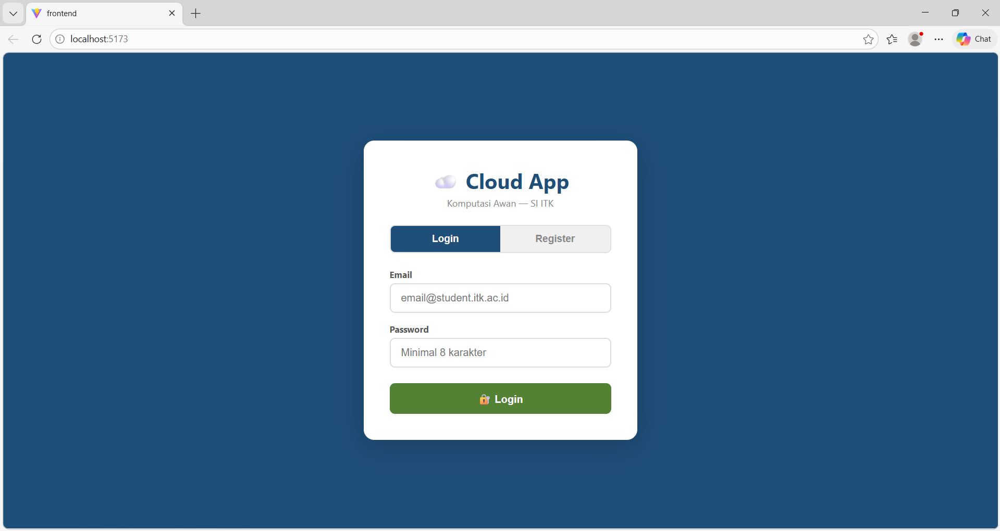

---

### 🧪Register Form
Halaman register digunakan oleh pengguna untuk membuat akun baru sebelum dapat mengakses aplikasi. Pada halaman ini, pengguna diminta untuk mengisi nama lengkap, email, dan password sebagai proses pendaftaran akun.

- **Tujuan**: Memastikan halaman register dapat diakses dan form dapat diisi dengan data yang valid
- **Langkah Pengujian**:
  1. Membuka halaman aplikasi
  2. Memilih tab **Register**
  3. Mengisi data (nama lengkap, email, dan password)
- **Hasil yang Diharapkan**: Data dapat diinput dan tombol register dapat digunakan
- **Hasil Pengujian**: Form register berhasil ditampilkan dan dapat diisi dengan data yang valid

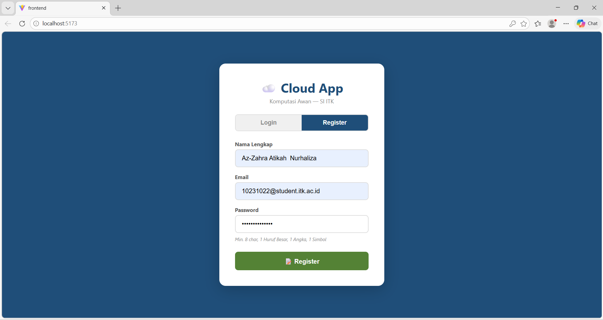

--- 

### 🧪Auto Login Setelah Register
Setelah pengguna berhasil melakukan registrasi, sistem secara otomatis mengarahkan pengguna ke halaman utama aplikasi tanpa perlu login ulang. Pada halaman ini, nama pengguna ditampilkan di bagian header, serta halaman utama (dashboard) dapat diakses.

- **Tujuan**: Memastikan sistem melakukan auto login setelah proses registrasi berhasil
- **Langkah Pengujian**:
  1. Mengisi form register dengan data valid
  2. Menekan tombol register
  3. Mengamati halaman setelah registrasi
- **Hasil yang Diharapkan**: User langsung masuk ke halaman utama aplikasi dan nama user tampil
- **Hasil Pengujian**: User berhasil langsung masuk ke halaman utama (dashboard) dan nama user tampil di header

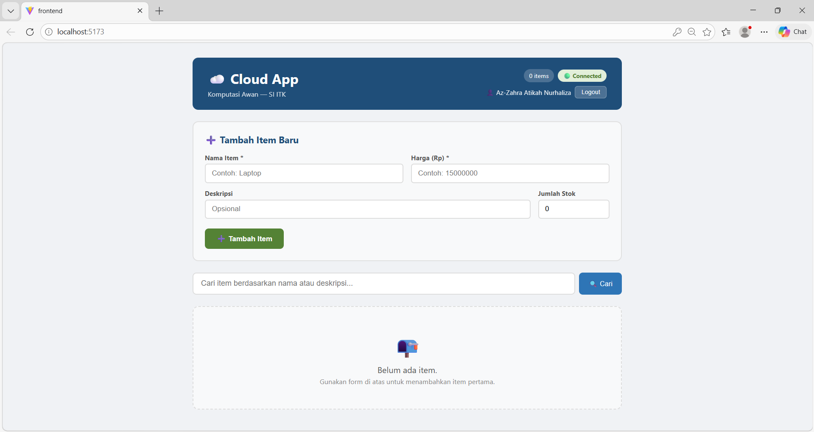

---

### 🧪CRUD Item (Create & Read)

Halaman utama (dashboard) menampilkan form untuk menambahkan item baru serta daftar item yang telah berhasil disimpan. Pengguna dapat mengisi nama item, harga, deskripsi, dan jumlah stok, lalu menambahkan item ke dalam sistem. Setelah berhasil ditambahkan, item akan langsung muncul pada daftar di bawah form.

- **Tujuan**: Memastikan fitur tambah (create) dan tampil (read) data item berjalan dengan baik
- **Langkah Pengujian**:
  1. Mengisi form tambah item (nama, harga, deskripsi, stok)
  2. Menekan tombol "Tambah Item"
  3. Mengamati daftar item
- **Hasil yang Diharapkan**: Item yang ditambahkan muncul pada daftar item
- **Hasil Pengujian**: Item berhasil ditambahkan dan langsung tampil pada daftar item di bawah form

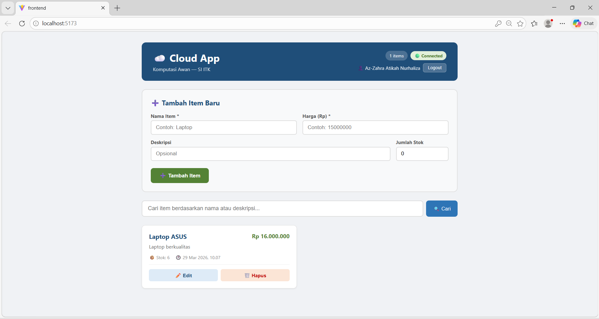

---

### 🧪Create Notification (Tambah Item Berhasil)
Sistem menampilkan notifikasi berupa pop-up ketika pengguna berhasil menambahkan item baru. Notifikasi ini muncul setelah pengguna mengisi form dan menekan tombol tambah item, sebagai tanda bahwa proses penyimpanan data berhasil dilakukan.

- **Tujuan**: Memastikan sistem memberikan notifikasi ketika proses tambah item berhasil
- **Langkah Pengujian**:
  1. Mengisi form tambah item (nama, harga, deskripsi, stok)
  2. Menekan tombol "Tambah Item"
  3. Mengamati notifikasi yang muncul
- **Hasil yang Diharapkan**: Muncul notifikasi bahwa item berhasil ditambahkan
- **Hasil Pengujian**: Notifikasi "Item berhasil ditambahkan" muncul dalam bentuk pop-up setelah item disimpan

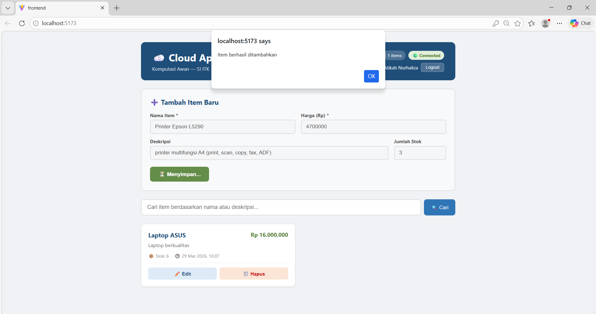

---

### 🧪Edit Notification (Update Item Berhasil)
Sistem menampilkan notifikasi ketika pengguna berhasil melakukan perubahan (edit) pada data item. Notifikasi ini muncul setelah pengguna mengubah data pada form edit dan menekan tombol simpan, sebagai tanda bahwa proses update data berhasil dilakukan.

- **Tujuan**: Memastikan sistem memberikan notifikasi saat proses edit/update item berhasil
- **Langkah Pengujian**:
  1. Menekan tombol "Edit" pada salah satu item
  2. Mengubah data item (nama, harga, deskripsi, atau stok)
  3. Menekan tombol "Simpan"
  4. Mengamati notifikasi yang muncul
- **Hasil yang Diharapkan**: Muncul notifikasi bahwa item berhasil diperbarui
- **Hasil Pengujian**: Notifikasi muncul setelah tombol simpan ditekan, menandakan data item berhasil diperbarui

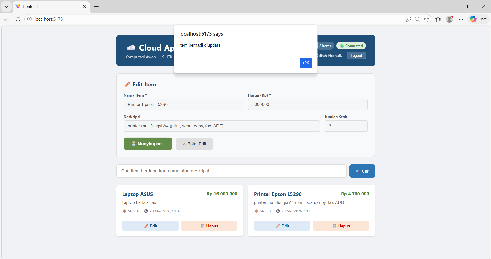

---

### 🧪Logout
Halaman login akan ditampilkan kembali setelah pengguna melakukan logout dari sistem. Ini menandakan bahwa sesi pengguna telah berakhir dan akses ke halaman utama sudah ditutup.

- **Tujuan**: Memastikan fitur logout dapat mengakhiri sesi pengguna dan mengarahkan kembali ke halaman login
- **Langkah Pengujian**:
  1. Menekan tombol "Logout" pada halaman dashboard
  2. Mengamati perubahan halaman
- **Hasil yang Diharapkan**: Pengguna keluar dari sistem dan diarahkan ke halaman login
- **Hasil Pengujian**: Setelah menekan tombol logout, pengguna berhasil keluar dan halaman login ditampilkan kembali

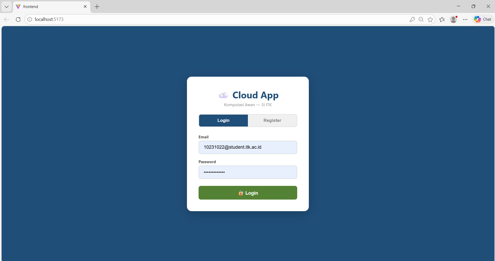

---

### 🧪 Login Again
Setelah login berhasil, pengguna langsung diarahkan ke halaman utama (dashboard). Di bagian atas terlihat nama pengguna (**Az-Zahra Atikah Nurhaliza**), yang menandakan akun sudah terdeteksi dengan benar. Status "Connected" juga muncul, dan daftar item seperti Laptop ASUS dan Printer Epson L5290 sudah tampil, jadi bisa dipastikan data berhasil dimuat.

- **Tujuan**: Memastikan setelah login, pengguna masuk ke dashboard dengan data yang sesuai
- **Langkah Pengujian**:
  1. Login menggunakan akun yang sudah terdaftar
  2. Cek nama pengguna di bagian header
  3. Lihat apakah data item dan form "Tambah Item Baru" muncul
- **Hasil yang Diharapkan**: Pengguna masuk ke dashboard, nama tampil dengan benar, dan semua fitur bisa diakses
- **Hasil Pengujian**: Login berhasil, nama pengguna tampil sesuai, dan halaman dashboard beserta data item berhasil dimuat

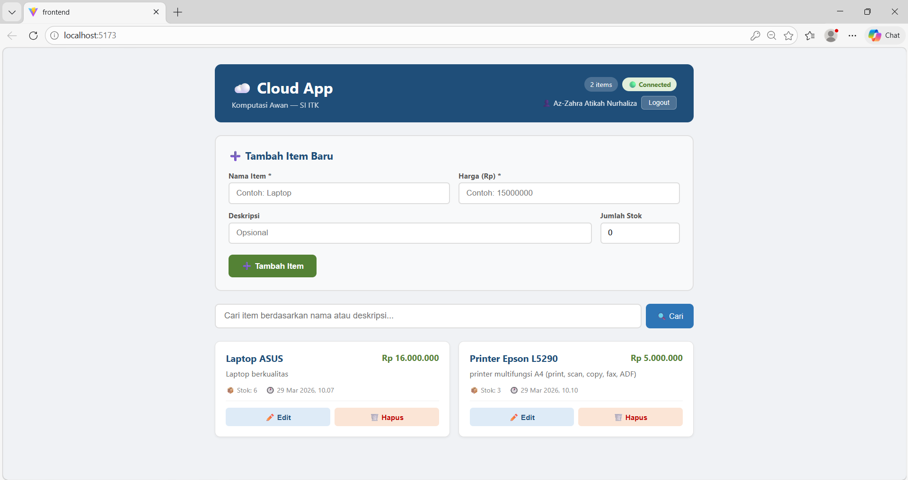

---

### 🧪 Validasi Token API (401 Unauthorized)
Pengujian ini dilakukan untuk melihat respon server ketika API diakses tanpa token autentikasi. Hasilnya, server langsung menolak request dan menampilkan status **401 Unauthorized** dengan pesan "Not authenticated". Hal ini menunjukkan bahwa endpoint yang diproteksi memang tidak bisa diakses sembarangan.

Pengujian dilakukan menggunakan dua tools, yaitu Swagger UI dan Thunder Client, dan keduanya menunjukkan hasil yang sama (konsisten).

- **Tujuan**: Memastikan API hanya bisa diakses jika menggunakan token yang valid
- **Langkah Pengujian**:
  1. Membuka Swagger UI atau Thunder Client
  2. Memilih endpoint yang memerlukan autentikasi
  3. Mengirim request tanpa menyertakan token (Authorization Bearer)
  4. Melihat respon dari server
- **Hasil yang Diharapkan**: Server menolak request dengan status 401 dan pesan bahwa user belum terautentikasi
- **Hasil Pengujian**: Server menolak request dengan status 401 dan pesan "Not authenticated" pada kedua tools, sehingga bisa dipastikan sistem keamanan berjalan dengan baik

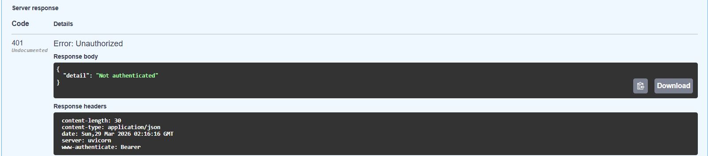
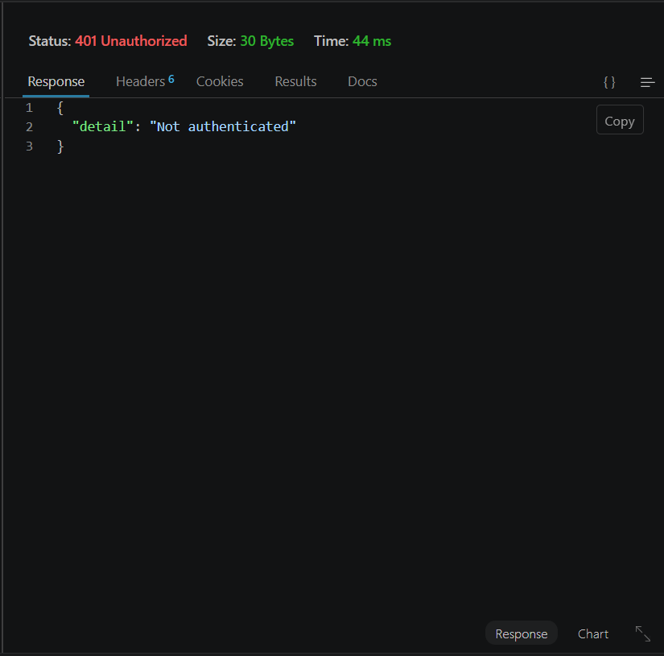

---

### 🧪 Get Data Item (Status 200 OK)

Pengujian ini dilakukan untuk mengambil data item dari API. Awalnya pengujian dicoba melalui Swagger UI, namun terjadi error **422 (Unprocessable Entity)** karena Swagger menggunakan OAuth2 password flow (username & password), sedangkan backend menerima format JSON `{email, password}`. 

Karena itu, pengujian dialihkan ke Thunder Client di VS Code dengan menambahkan token secara manual pada header (`Authorization: Bearer <token>`).

Hasilnya, request berhasil dan server mengembalikan status **200 OK** beserta data item dalam bentuk JSON. Data yang tampil sesuai dengan yang ada di database, seperti Laptop ASUS dan Printer Epson L5290.

- **Tujuan**: Memastikan endpoint untuk mengambil data item bisa diakses dan mengembalikan data dengan benar
- **Langkah Pengujian**:
  1. Membuka Thunder Client di VS Code
  2. Memasukkan endpoint `GET /items`
  3. Menambahkan header `Authorization: Bearer <token>`
  4. Mengirim request
- **Hasil yang Diharapkan**: Server mengembalikan status 200 dan data item tampil
- **Hasil Pengujian**: Server merespon 200 OK dan data item berhasil ditampilkan sesuai database

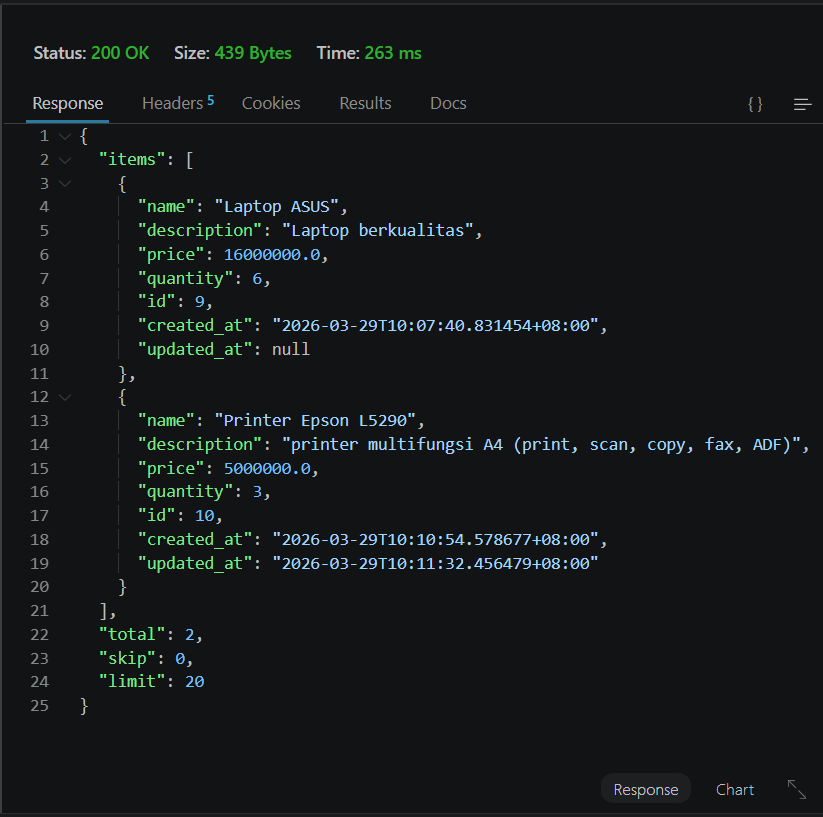

---

## 🧪 Hasil Testing Modul 4

### 🔍 Testing Scenario: Authentication & Items Flow

| No | Skenario Testing | Hasil | Keterangan |
|----|------------------|--------|------------|
| 1 | Login page muncul | ✅ Berhasil | Halaman login tampil dengan normal saat aplikasi dibuka |
| 2 | Register user baru | ✅ Berhasil | User berhasil dibuat dan tersimpan di database |
| 3 | Otomatis login setelah register | ✅ Berhasil | Sistem langsung memberikan akses setelah registrasi |
| 4 | Dashboard & data item tampil | ✅ Berhasil | Halaman utama dan daftar item muncul dengan benar |
| 5 | Nama user di header | ✅ Berhasil | Nama user tampil sesuai akun yang login |
| 6 | CRUD items berfungsi | ✅ Berhasil | Create, Read, Update, Delete berjalan normal |
| 7 | Notifikasi sistem muncul | ✅ Berhasil | Notifikasi tampil saat create dan update item |
| 8 | Logout | ✅ Berhasil | User berhasil keluar dari sistem |
| 9 | Login kembali | ✅ Berhasil | User dapat login kembali tanpa kendala |
| 10 | Data tetap tersimpan | ✅ Berhasil | Data item tetap ada (persistent di database) |

---