## 📋 Tabel Pengujian API — SiCure Procurement System

| Kode Testing | Skenario Pengujian | Langkah Pengujian | Hasil yang Diharapkan | Hasil Aktual | Status | Bukti |
|-------------|------------------|------------------|----------------------|--------------|--------|-------|
| API-01 | Health check endpoint berjalan dengan baik | Jalankan endpoint GET /health melalui Swagger UI dengan klik "Try it out" lalu "Execute" | Sistem menampilkan status layanan API dalam kondisi aktif dengan kode response 200 | Endpoint GET /health berhasil dijalankan dan mengembalikan response **200 OK** dengan isi `"status": "ok"` dan `"env": "development"` yang menunjukkan API berjalan dengan baik | ✅ Berhasil | 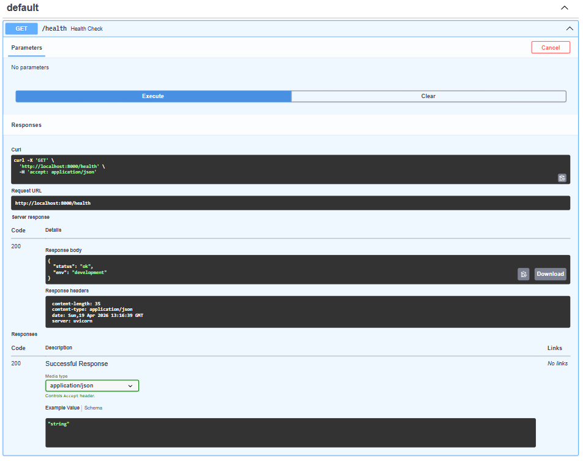  |
| API-02 | Registrasi user baru sebagai requester berhasil | Buka Swagger → pilih endpoint POST /api/v1/auth/register-requester → klik **Try it out** → isi request body dengan data user (email, password, full_name) → klik **Execute** | Sistem berhasil membuat akun baru dengan role requester dan mengembalikan response **201 Created** beserta data user | Endpoint berhasil dijalankan dan mengembalikan response **201 Created** dengan data user seperti id, email, full_name, role requester, serta pesan "Registrasi berhasil silakan login" | ✅ Berhasil | 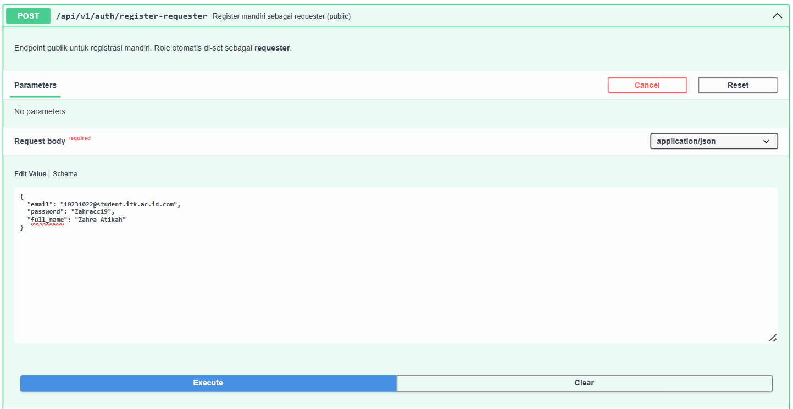 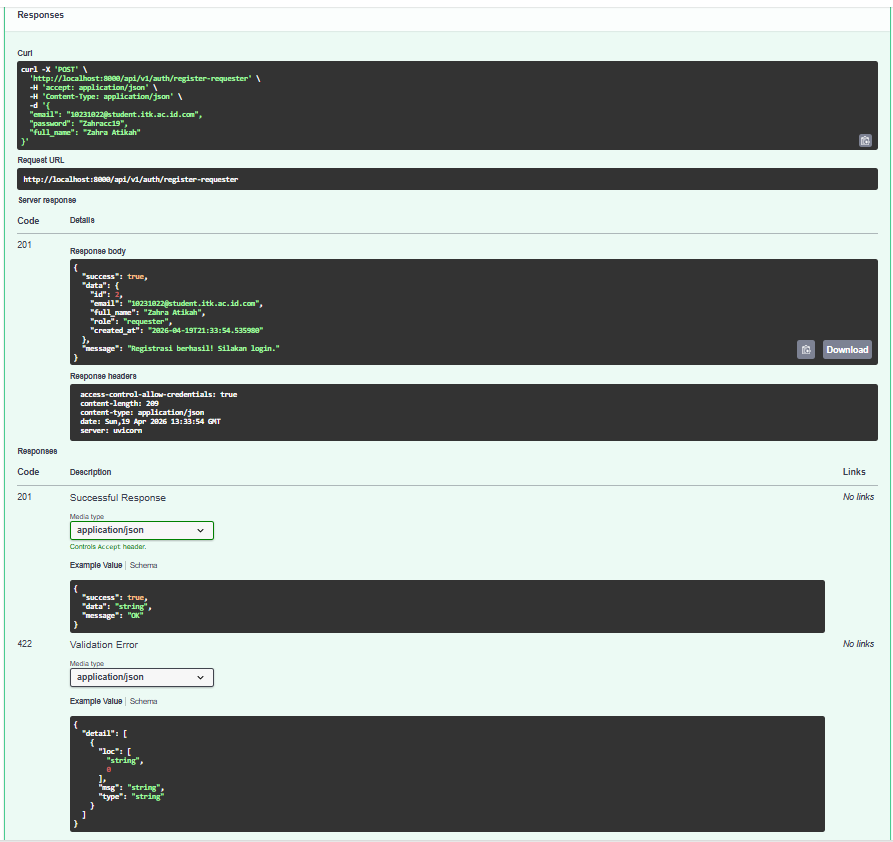 |
| API-03 | Login user untuk mendapatkan token autentikasi | Pilih endpoint POST /api/v1/auth/login → klik **Try it out** → isi email dan password yang sudah terdaftar pada request body → klik **Execute** | Sistem memvalidasi data login dan mengembalikan response **200 OK** yang berisi access_token dan refresh_token | Endpoint berhasil dijalankan dengan response **200 OK**, sistem mengembalikan access_token (berlaku 30 menit), refresh_token (berlaku 7 hari), serta pesan "Login berhasil" | ✅ Berhasil | 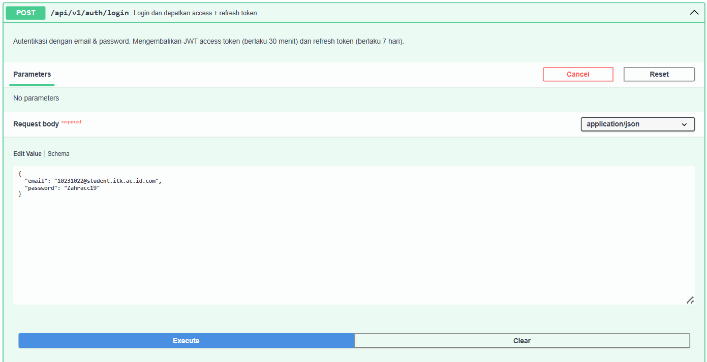 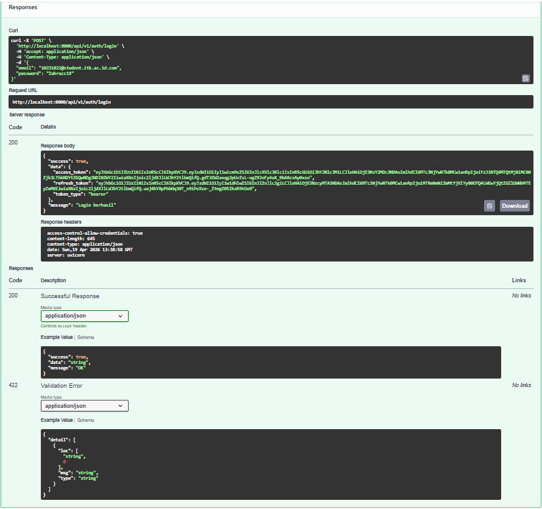 |
| API-04 | Autentikasi menggunakan Bearer Token di Swagger UI | Klik tombol **Authorize** di pojok kanan atas → masukkan access_token dari hasil login dengan format: Bearer <token> → klik **Authorize** → lalu klik **Close** | Token tersimpan di Swagger dan endpoint yang butuh autentikasi bisa diakses | Token berhasil dimasukkan dan status berubah menjadi **Authorized**. Endpoint yang memiliki ikon gembok sudah bisa diakses menggunakan akun tersebut | ✅ Berhasil | 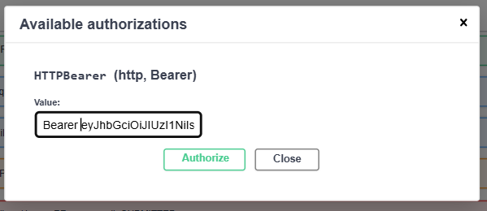 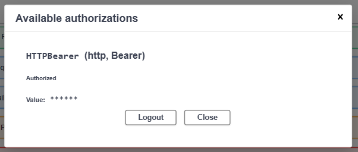 |
| API-05 | Mendapatkan profil user yang sedang login | Pilih endpoint GET /api/v1/auth/me → klik **Try it out** → klik **Execute** | Sistem mengenali token user dan menampilkan data profil sesuai akun yang sedang login | Endpoint berhasil dijalankan dengan response **200 OK**, sistem menampilkan data user seperti id, email, full_name (Zahra Atikah), dan role (requester) | ✅ Berhasil | 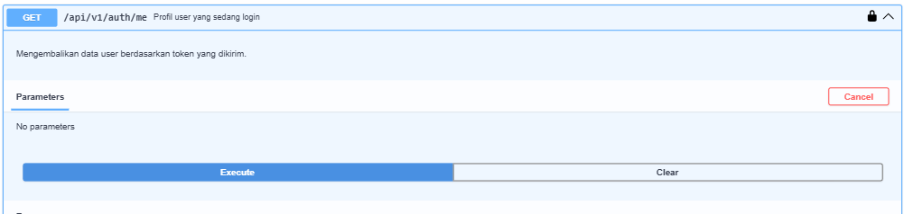 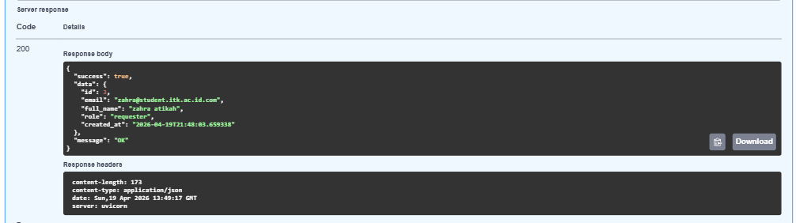 |
| API-06 | Membuat Purchase Requisition (PR) baru sebagai requester | Pilih endpoint POST /api/v1/requisitions/ → klik **Try it out** → isi request body dengan data PR (title, justification, items) → klik **Execute** | Sistem berhasil menyimpan PR baru, menghitung total biaya otomatis, dan mengembalikan response **201 Created** | Endpoint berhasil dijalankan dengan response **201 Created**, sistem membuat nomor PR otomatis (PR-20260419-...), status "SUBMITTED", serta total amount Rp30.000.000 sesuai item yang diinput | ✅ Berhasil | 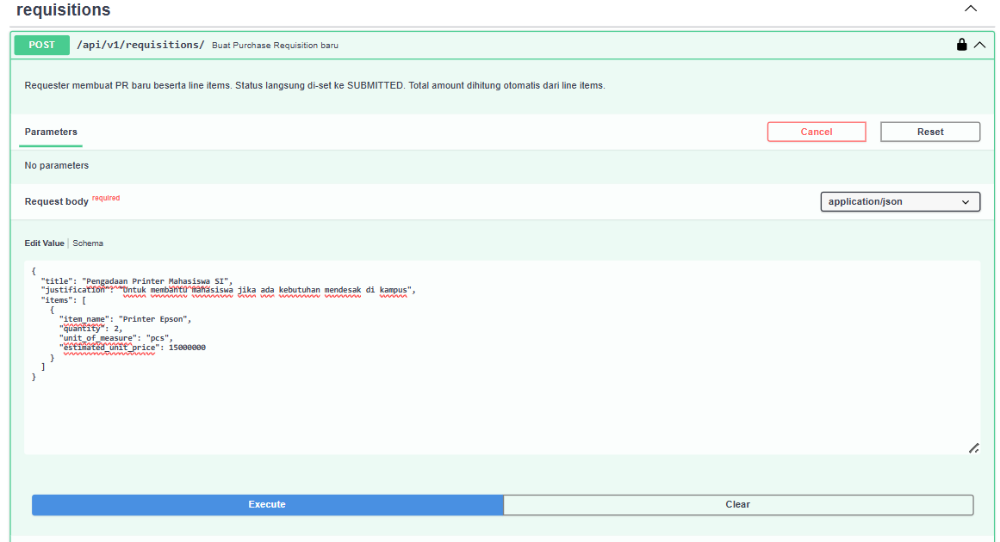 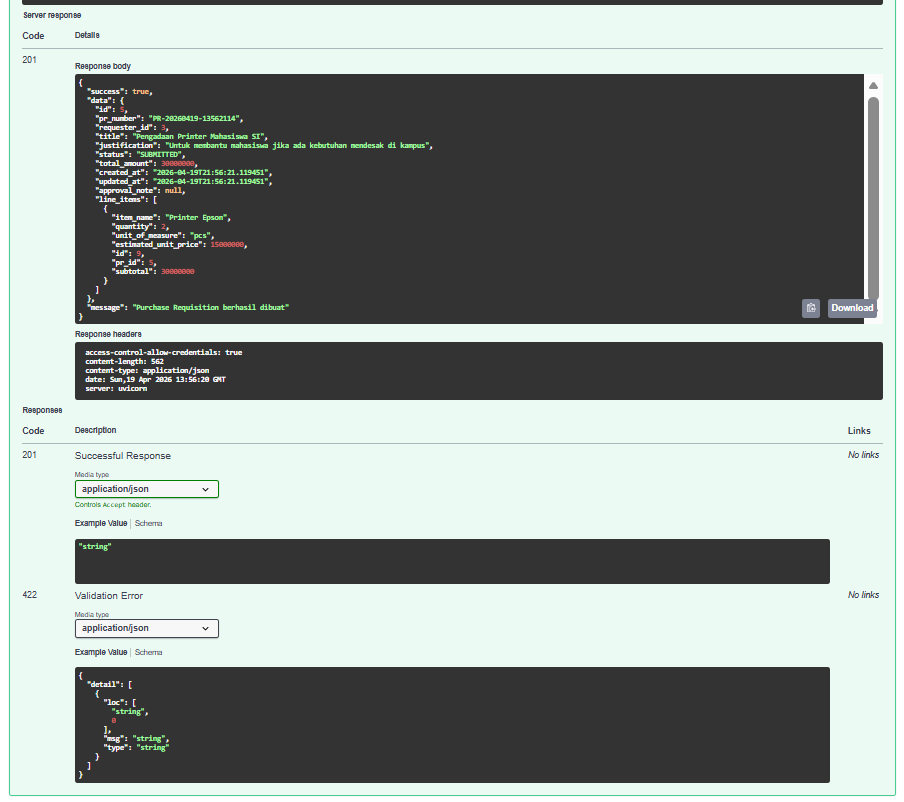 |
| API-07 | Menampilkan daftar Purchase Requisition (PR) milik requester | Pilih endpoint GET /api/v1/requisitions/ → klik **Try it out** → isi parameter pagination (page: 1, per_page: 10) → klik **Execute** | Sistem menampilkan daftar PR yang pernah dibuat oleh user dalam bentuk list beserta informasi pagination | Endpoint berhasil dijalankan dengan response **200 OK**, sistem menampilkan daftar PR (termasuk PR ID 5 yang baru dibuat) serta informasi pagination (page: 1, total: 1) | ✅ Berhasil | 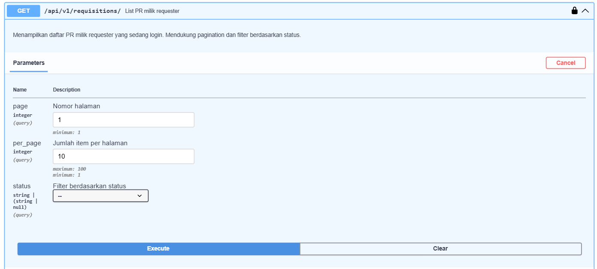 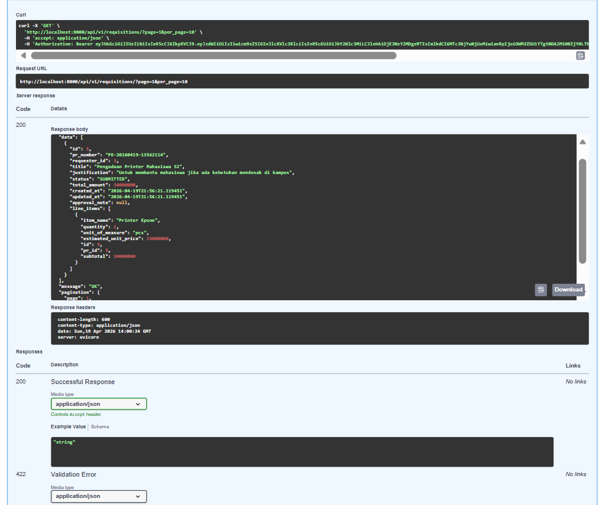 |
| API-08 | Melihat detail Purchase Requisition (PR) berdasarkan ID | Pilih endpoint GET /api/v1/requisitions/{pr_id} → klik **Try it out** → masukkan pr_id (contoh: 5) → klik **Execute** | Sistem menampilkan detail PR yang dipilih, termasuk daftar item di dalamnya | Endpoint berhasil dijalankan dengan response **200 OK**, sistem menampilkan detail PR ID 5 secara lengkap, termasuk informasi requester, status SUBMITTED, dan daftar line_items | ✅ Berhasil | 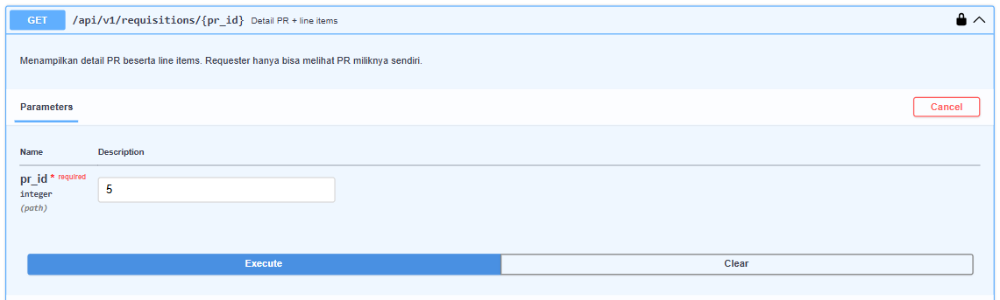 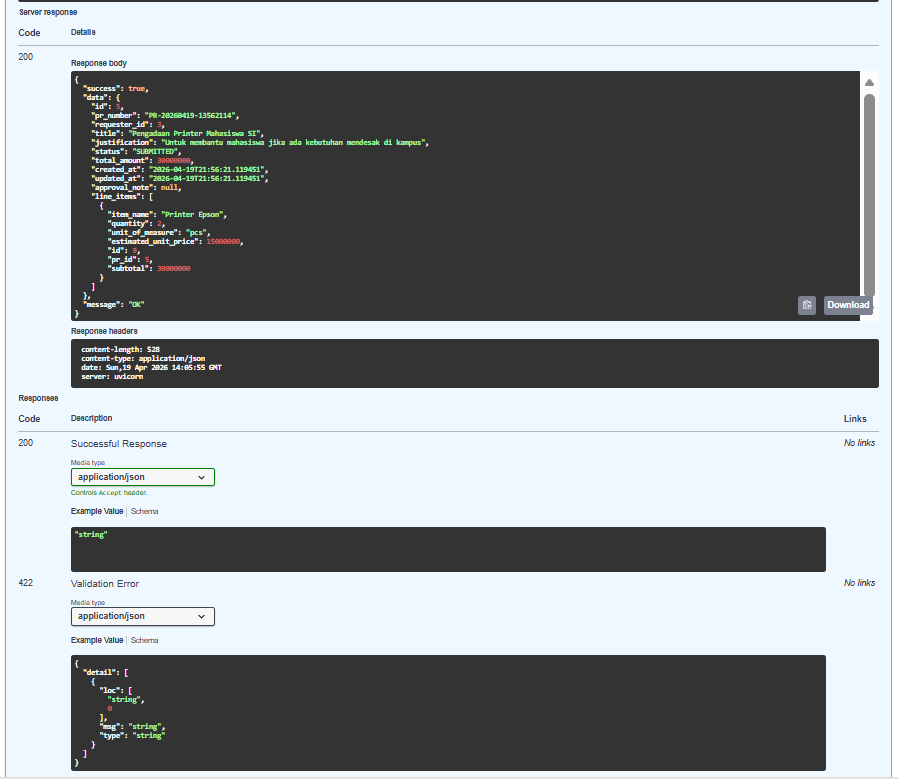 |
| API-09 | Memperbarui data Purchase Requisition (PR) | Pilih endpoint PUT /api/v1/requisitions/{pr_id} → isi pr_id (contoh: 5) → ubah data pada request body (title, justification, atau items) → klik **Execute** | Sistem memperbarui data PR di database dan mengembalikan response **200 OK** dengan data terbaru | Endpoint mengembalikan response **500 Internal Server Error**. Kemungkinan terjadi karena input tidak sesuai (misalnya field numerik diisi string) atau ada ketidaksesuaian data saat proses update | ❌ Gagal | 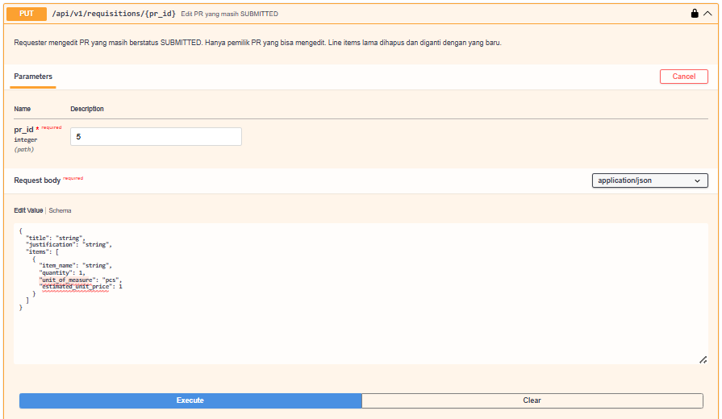 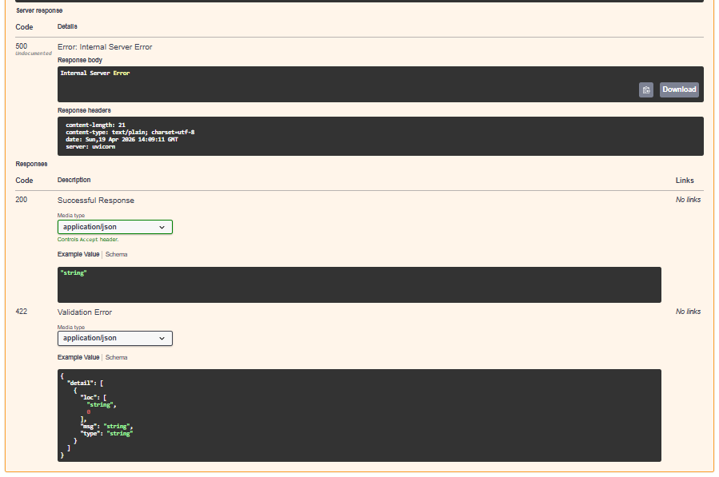 |
| API-10 | Menghapus atau membatalkan Purchase Requisition (PR) | Pilih endpoint DELETE /api/v1/requisitions/{pr_id} → masukkan pr_id (contoh: 5) → klik **Execute** | Sistem menghapus data PR beserta seluruh item di dalamnya dan memberikan konfirmasi | Endpoint berhasil dijalankan dengan response **200 OK**, sistem menampilkan pesan "Purchase Requisition berhasil dibatalkan dan dihapus" serta mengembalikan data null | ✅ Berhasil | 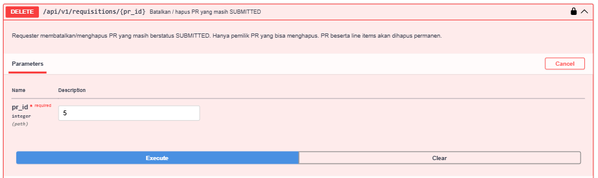 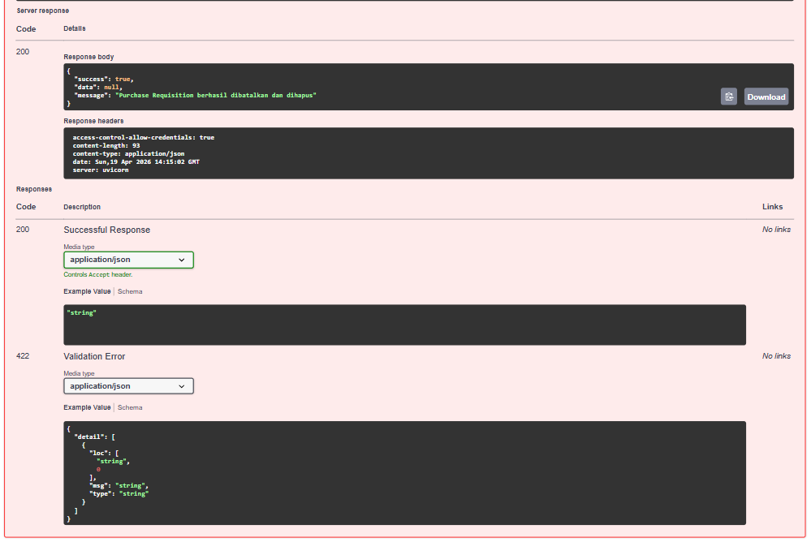 |
| API-11a | Error handling: mencari data yang tidak ada (404 Not Found) | Pilih endpoint GET /api/v1/requisitions/{pr_id} → masukkan ID yang tidak terdaftar (contoh: 999) → klik **Execute** | Sistem menampilkan response **404 Not Found** dengan pesan error yang jelas | Endpoint mengembalikan response **404 Not Found**, sistem menampilkan pesan "Requisition not found" yang menunjukkan data tidak ditemukan sudah ditangani dengan baik | ✅ Berhasil | 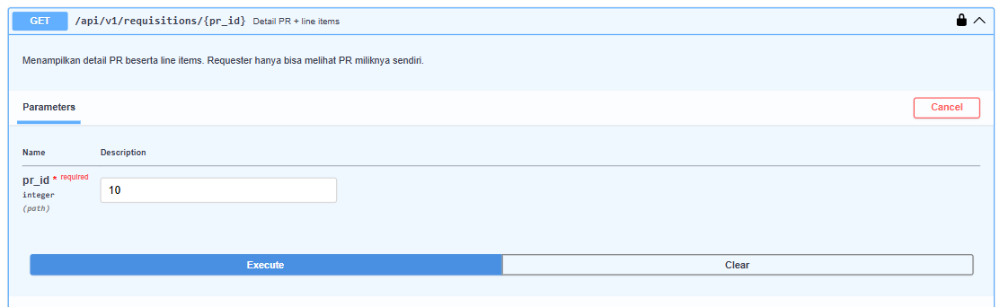 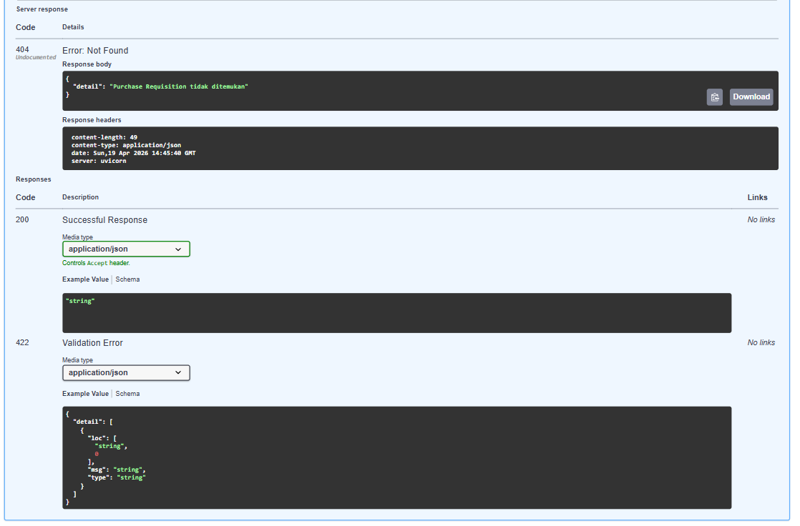 |
| API-11b | Error handling: akses tanpa token / belum login (401 Unauthorized) | Klik **Logout** pada tombol Authorize (hapus token) → akses endpoint GET /api/v1/auth/me → klik **Execute** | Sistem menolak akses dan menampilkan response **401 Unauthorized** | Endpoint mengembalikan response **401 Unauthorized**, sistem menampilkan pesan "Not authenticated" yang menunjukkan fitur keamanan berjalan dengan baik | ✅ Berhasil | 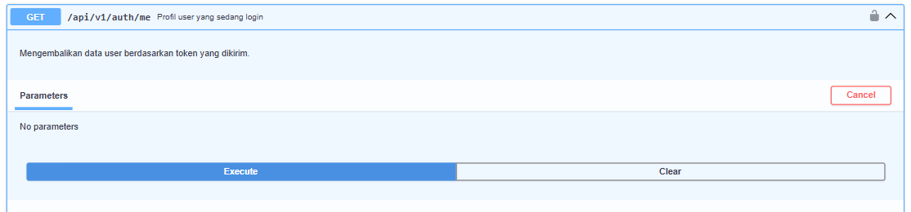 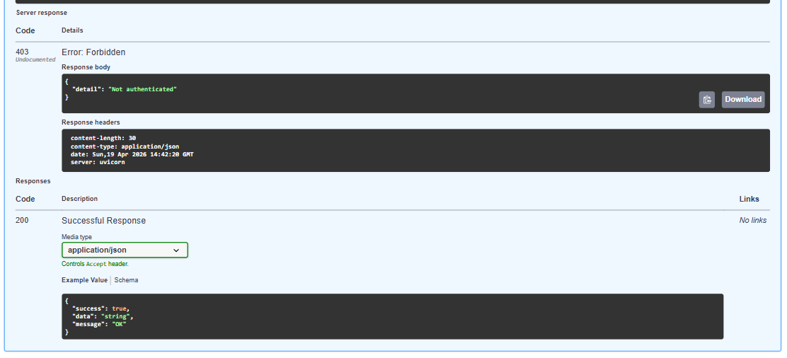 |

## 📝 Kesimpulan

Berdasarkan hasil pengujian yang telah dilakukan, sebagian besar endpoint pada API SiCure Procurement System telah berjalan dengan baik dan sesuai dengan yang diharapkan. Hal ini dapat dilihat dari keberhasilan proses utama seperti registrasi, login, autentikasi, pengambilan data user, serta fitur CRUD pada Purchase Requisition (PR) yang menghasilkan response dengan status code yang tepat (200 dan 201).

Selain itu, mekanisme keamanan juga sudah berfungsi dengan baik, ditunjukkan dari keberhasilan pengujian autentikasi menggunakan token serta penanganan error seperti **401 Unauthorized** dan **404 Not Found** yang memberikan response sesuai kondisi.

Namun, masih terdapat kendala pada proses update PR (API-09) yang menghasilkan **500 Internal Server Error**. Hal ini kemungkinan disebabkan oleh input data yang tidak sesuai atau adanya masalah pada proses pengolahan data di backend.

Secara keseluruhan, API sudah berjalan dengan cukup baik dan memenuhi sebagian besar kebutuhan fungsional, meskipun masih perlu perbaikan pada beberapa bagian agar sistem dapat berjalan lebih optimal.