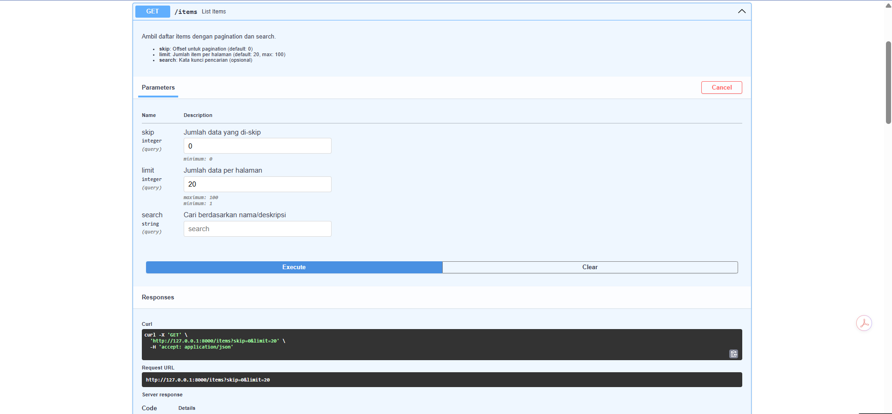

# Screenshoot/Dokumentasi Hasil Testing Semua Endpoint Via Swagger/Thunder Client

- Cloud App API. Halaman tersebut menunjukkan halaman utama API yang berisi daftar endpoint seperti **GET, POST, PUT, dan DELETE** untuk mengelola data items. Halaman ini digunakan untuk melihat dan mencoba fungsi API secara langsung.

- Halaman tersebut menampilkan detail endpoint GET /health pada dokumentasi API. Endpoint ini digunakan untuk mengecek apakah API berjalan dengan baik, dan jika berhasil akan menampilkan respons berupa status “healthy” serta informasi versi API yang sedang digunakan.

- Halaman tersebut menampilkan dokumentasi endpoint POST /items pada API yang digunakan untuk menambahkan data item baru. Pada halaman ini ditunjukkan parameter yang harus diisi seperti name, description, price, dan quantity, contoh format data yang dikirim dalam bentuk JSON, serta contoh respons yang akan diterima jika data berhasil ditambahkan atau jika terjadi kesalahan validasi.

- Halaman tersebut menampilkan dokumentasi endpoint GET /items pada API yang digunakan untuk mengambil daftar data item. Pada halaman ini terlihat beberapa parameter seperti skip untuk melewati jumlah data tertentu, limit untuk menentukan jumlah data yang ditampilkan per halaman, dan search untuk mencari item berdasarkan nama atau deskripsi, serta terdapat tombol Execute untuk mencoba menjalankan permintaan API secara langsung.

Gambar tersebut juga menampilkan hasil respons dari endpoint **GET `/items`** pada dokumentasi API setelah permintaan dijalankan. Pada bagian ini terlihat data item yang ditampilkan dalam format **JSON**, yang berisi informasi seperti **nama item, deskripsi, harga, jumlah stok, serta waktu pembuatan dan pembaruan data**, sehingga pengguna dapat melihat daftar item yang tersimpan di sistem.

- Halaman tersebut menampilkan Swagger UI yang digunakan untuk menguji endpoint API GET /items/stats untuk melihat statistik inventori. Setelah tombol Execute dijalankan, sistem mengirim request ke http://127.0.0.1:8000/items/stats dan menampilkan response JSON berisi jumlah total item, total nilai barang, serta data barang paling mahal dan paling murah. Status 200 menunjukkan bahwa request berhasil diproses oleh server.

- Halaman tersebut menampilkan Swagger UI untuk endpoint API **GET /items/{item_id}** yang digunakan untuk mengambil data satu item berdasarkan ID. Pada bagian parameter, pengguna harus memasukkan item_id terlebih dahulu. Jika request berhasil, sistem akan menampilkan response JSON yang berisi informasi item seperti nama, deskripsi, harga, jumlah, ID, serta waktu pembuatan dan pembaruan data. Terdapat juga kemungkinan error 422 (Validation Error) jika input yang diberikan tidak sesuai.

- Halaman tersebut menampilkan Swagger UI untuk endpoint API **PUT `/items/{item_id}`** yang digunakan untuk memperbarui data item berdasarkan ID. Pengguna harus memasukkan **item_id** dan mengirim data JSON seperti nama, deskripsi, harga, atau jumlah pada request body. Jika berhasil, server akan menampilkan **response JSON** berisi data item yang telah diperbarui beserta waktu update. Jika data yang dikirim tidak valid, sistem akan menampilkan error 422 (Validation Error).

- Halaman tersebut menampilkan Swagger UI untuk endpoint API **DELETE `/items/{item_id}`** yang digunakan untuk **menghapus data item berdasarkan ID**. Pengguna harus memasukkan **item_id** terlebih dahulu sebelum menjalankan request. Pada gambar terlihat pesan **validation error** karena kolom **item_id** belum diisi. Jika berhasil dijalankan, server akan memberikan **status 204 (Successful Response)** yang berarti data item berhasil dihapus.

- Halaman tersebut menampilkan **Swagger UI** untuk endpoint API **GET `/team`** yang digunakan untuk menampilkan **informasi tim**. Endpoint ini tidak memerlukan parameter, sehingga pengguna hanya perlu menjalankan request untuk mendapatkan data. Setelah dijalankan, server memberikan **response JSON** yang berisi nama tim serta daftar anggota tim lengkap dengan **nama, NIM, dan peran masing-masing**, seperti Lead Backend, Lead Frontend, Lead DevOps, dan Lead QA & Docs. Status **200** menunjukkan bahwa permintaan berhasil diproses.

