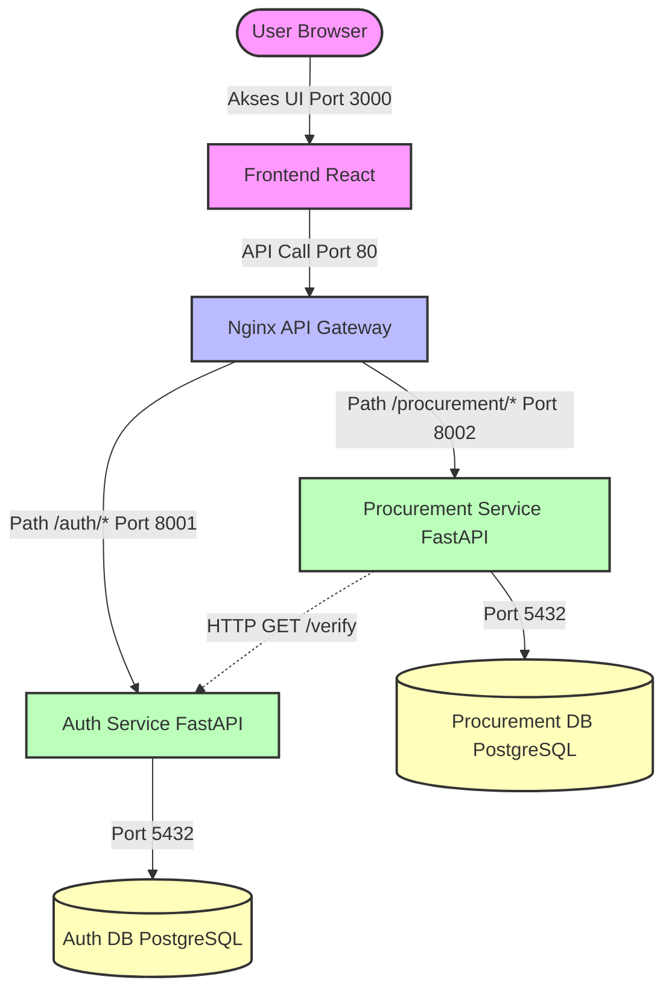

# Dokumentasi Arsitektur Microservices — SiCure

Dokumen ini menjelaskan arsitektur sistem **SiCure (Sistem Information Procurement)** setelah didekomposisi dari struktur Monolith menjadi Microservices, lengkap dengan pemetaan port, API Contract, dan panduan operasional lokal.

Tujuan penyusunan dokumen ini adalah:

- Menjadi panduan utama bagi seluruh tim dalam memahami arsitektur sistem microservices.
- Menstandarkan integrasi antar layanan melalui API Contract yang disepakati bersama.
- Mempermudah proses kolaborasi dan konfigurasi lingkungan pengembangan lokal.
- Menjadi pedoman dalam pemeliharaan, monitoring, dan troubleshooting sistem.

---

## 1. Diagram Arsitektur Sistem

Berikut adalah visualisasi arsitektur microservices SiCure. Fungsionalitas terbagi menjadi dua service utama — Auth Service dan Procurement Service — dengan Nginx sebagai API Gateway tunggal dan database PostgreSQL yang saling terisolasi (Database per Service). 

# ini disesuaikan dlu apakah nama services dan path berbeda



---

## 2. Daftar Service dan Alokasi Port

Aplikasi dipetakan menjadi 6 container yang berjalan di dalam jaringan Docker internal. Berikut adalah spesifikasi port untuk masing-masing layanan:

| Service | Port Host | Port Container | Deskripsi |
|---------|-----------|----------------|-----------|
| `gateway` | 80 | 80 | API Gateway — reverse proxy tunggal untuk semua request |
| `frontend` | 3000 | 3000 | React SPA — UI aplikasi procurement |
| `auth-service` | 8001 | 8001 | Registrasi, login, dan verifikasi JWT token |
| `procurement-service` | 8002 | 8002 | Requisitions, Purchase Orders, dan GRN |
| `auth-db` | 5433 | 5432 | Database PostgreSQL khusus kredensial pengguna |
| `procurement-db` | 5434 | 5432 | Database PostgreSQL khusus data procurement |

> **Catatan:** Port host database diarahkan ke 5433 dan 5434 agar tidak bentrok dengan instalasi PostgreSQL lokal (default 5432).

# konformasi lagi port yg dipake (docker compose)

---

## 3. API Contract

Seluruh request dari client harus dikirim melalui API Gateway pada port `80`. Nginx akan meneruskan request secara otomatis ke service yang sesuai.

### A. Routing Table (Nginx Gateway) (cek dlu nginx)

| Path Pattern | Target Service | Keterangan |
|-------------|----------------|------------|
| `/auth/*` | `auth-service:8001` | Semua endpoint autentikasi |
| `/procurement/*` | `procurement-service:8002` | Requisitions, PO, GRN |
| `/health` | Gateway langsung | Health check aggregator |
| `/*` (default) | `frontend:3000` | React SPA fallback |

---

### B. Auth Service (cek dlu nama pathnya sama ga)

Layanan ini mengelola autentikasi pengguna, registrasi akun, login, serta verifikasi token JWT.

| Method | Endpoint | Auth | Deskripsi |
|--------|----------|------|-----------|
| `POST` | `/auth/register` | Public | Mendaftarkan akun pengguna baru |
| `POST` | `/auth/login` | Public | Validasi kredensial dan menghasilkan JWT token |
| `POST` | `/auth/logout` | User | Logout dan invalidasi token |
| `GET` | `/auth/verify` | Internal | Verifikasi token JWT dari service lain |
| `GET` | `/auth/me` | User | Mengambil data profil pengguna yang sedang login |

---

### C. Procurement Service (nama path tanya dlu sesuai ga)

Layanan ini mengelola seluruh proses procurement — dari permintaan pengadaan, purchase order, hingga penerimaan barang.

#### Requisitions (Permintaan Pengadaan)

| Method | Endpoint | Auth | Deskripsi |
|--------|----------|------|-----------|
| `GET` | `/procurement/requisitions` | User | Mengambil daftar semua permintaan pengadaan |
| `POST` | `/procurement/requisitions` | User | Membuat permintaan pengadaan baru |
| `GET` | `/procurement/requisitions/{id}` | User | Mengambil detail satu permintaan berdasarkan ID |
| `PUT` | `/procurement/requisitions/{id}` | User | Memperbarui data permintaan pengadaan |
| `DELETE` | `/procurement/requisitions/{id}` | Admin | Menghapus permintaan pengadaan |
| `GET` | `/procurement/requisitions/admin` | Admin | Daftar semua permintaan untuk review admin |

#### Purchase Orders

| Method | Endpoint | Auth | Deskripsi |
|--------|----------|------|-----------|
| `GET` | `/procurement/purchase-orders` | User | Mengambil daftar semua purchase order |
| `POST` | `/procurement/purchase-orders` | Admin | Membuat purchase order baru |
| `GET` | `/procurement/purchase-orders/{id}` | User | Mengambil detail purchase order berdasarkan ID |
| `PUT` | `/procurement/purchase-orders/{id}` | Admin | Memperbarui data purchase order |

#### GRN — Good Receipt Note (Penerimaan Barang)

| Method | Endpoint | Auth | Deskripsi |
|--------|----------|------|-----------|
| `GET` | `/procurement/grn` | User | Mengambil daftar semua penerimaan barang |
| `POST` | `/procurement/grn` | User | Mencatat penerimaan barang baru |
| `GET` | `/procurement/grn/{id}` | User | Mengambil detail penerimaan barang berdasarkan ID |
| `PUT` | `/procurement/grn/{id}` | Admin | Memperbarui data penerimaan barang |
| `GET` | `/procurement/grn/admin` | Admin | Daftar semua GRN untuk review admin |

> **Catatan:** Endpoint yang ditandai `[TANYA MUCHLIS]` perlu dikonfirmasi ke Lead Backend karena mungkin ada perbedaan nama path yang sebenarnya di kode.

---

## 4. Panduan Menjalankan Sistem Secara Lokal

### Prasyarat

Sebelum memulai, pastikan perangkat telah memenuhi kebutuhan berikut:

- Git sudah terinstal
- Docker dan Docker Desktop sudah terinstal dan aktif
- Port `80` dan `3000` tidak digunakan oleh aplikasi lain

### Langkah-Langkah

**1. Clone Repository**

```bash
git clone https://github.com/aidilsaputrakirsan-classroom/cc-kelompok-nyawit_1.git
cd cc-kelompok-nyawit_1
```

**2. Siapkan File Environment**

```bash
cp .env.example .env
```

> Edit file `.env` sesuai konfigurasi lokal jika diperlukan.

**3. Build dan Jalankan Semua Container**

```bash
docker compose up --build -d
```

> `--build` untuk build ulang image terbaru, `-d` untuk menjalankan di background.

**4. Periksa Status Container**

```bash
docker compose ps
```

> Pastikan seluruh container berstatus `Up` atau `healthy`.

**5. Akses Aplikasi**

| Layanan | URL |
|---------|-----|
| Frontend | http://localhost:3000 |
| API Gateway | http://localhost |
| Auth Service | http://localhost:8001/docs |
| Procurement Service | http://localhost:8002/docs |

**6. Menghentikan Semua Layanan**

```bash
docker compose down
```

---

## 5. Panduan Debug Per Service

### A. Melihat Log Container

**Log API Gateway (Nginx)**
```bash
docker compose logs -f gateway
```
> Gunakan untuk memeriksa masalah routing atau koneksi antar service.

**Log Auth Service**
```bash
docker compose logs -f auth-service
```
> Gunakan untuk memeriksa error pada proses login, register, atau verifikasi token.

**Log Procurement Service**
```bash
docker compose logs -f procurement-service
```
> Gunakan untuk memeriksa error pada requisitions, purchase orders, atau GRN.

**Log Database**
```bash
docker compose logs -f auth-db
docker compose logs -f procurement-db
```

### B. Masalah Umum dan Solusi

| No | Permasalahan | Penyebab | Solusi |
|----|-------------|----------|--------|
| 1 | `Connection Refused` pada Procurement Service | `AUTH_SERVICE_URL` masih menggunakan `localhost` | Ganti menjadi `AUTH_SERVICE_URL: http://auth-service:8001` |
| 2 | Perubahan kode tidak terefleksi | Docker masih pakai image lama | Jalankan `docker compose down -v` lalu `docker compose up --build -d` |
| 3 | Error `502 Bad Gateway` | Service backend crash atau belum siap | Cek status dengan `docker compose ps`, lalu cek log service yang bermasalah |
| 4 | Error `CORS Blocked` | Frontend akses API langsung ke port backend | Pastikan frontend akses melalui gateway `http://localhost/auth/...` |
| 5 | Data lama masih muncul setelah reset | Docker volume belum dihapus | Jalankan `docker compose down -v` untuk hapus volume lama |
| 6 | `401 Unauthorized` di Procurement Service | Token tidak diteruskan atau expired | Pastikan header `Authorization: Bearer <token>` disertakan, cek expiry token |