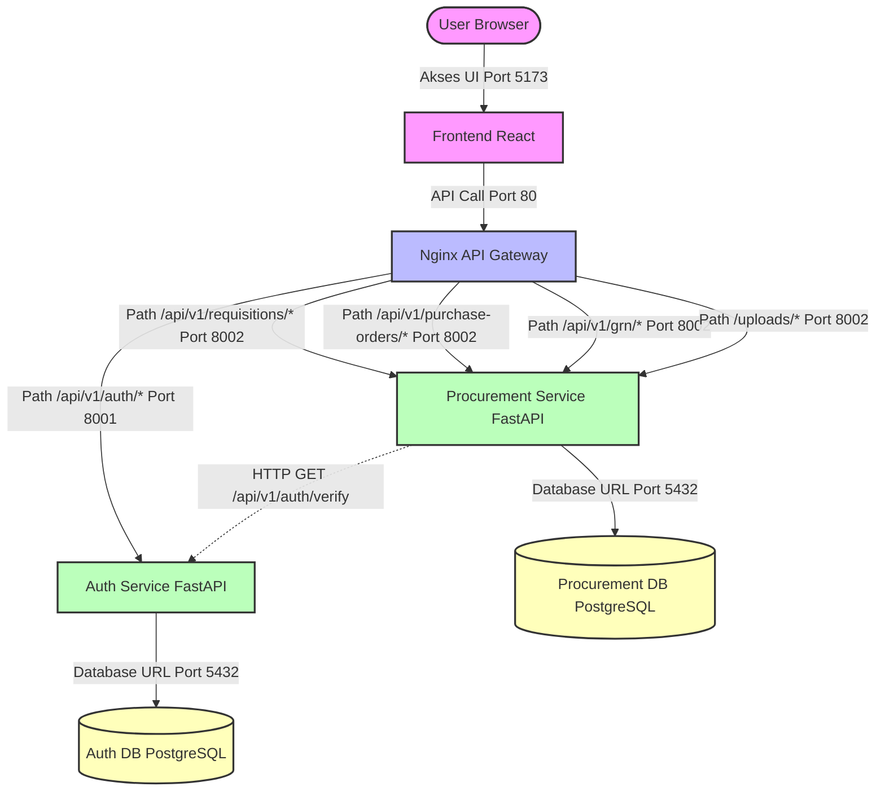

# Dokumentasi Arsitektur Microservices — SiCure

Dokumen ini menjelaskan arsitektur sistem **SiCure (Sistem Information Procurement)** setelah didekomposisi dari struktur Monolith menjadi Microservices, lengkap dengan pemetaan port, API Contract, dan panduan operasional lokal.

Tujuan penyusunan dokumen ini adalah:

- Menjadi panduan utama bagi seluruh tim dalam memahami arsitektur sistem microservices.
- Menstandarkan integrasi antar layanan melalui API Contract yang disepakati bersama.
- Mempermudah proses kolaborasi dan konfigurasi lingkungan pengembangan lokal.
- Menjadi pedoman dalam pemeliharaan, monitoring, dan troubleshooting sistem.

---

## 1. Diagram Arsitektur Sistem

Berikut adalah visualisasi arsitektur microservices SiCure yang telah diimplementasikan. Fungsionalitas terbagi menjadi dua service utama — **Auth Service** dan **Procurement Service** — dengan **Nginx** sebagai API Gateway tunggal dan database PostgreSQL yang saling terisolasi (Database per Service).



---

## 2. Daftar Service dan Alokasi Port

Aplikasi dipetakan menjadi 6 container yang berjalan di dalam jaringan Docker internal. Berikut adalah spesifikasi port untuk masing-masing layanan:

| Service | Port Host | Port Container | Deskripsi |
|---------|-----------|----------------|-----------|
| `gateway` | 80 | 80 | Nginx API Gateway — reverse proxy tunggal untuk semua request |
| `frontend` | 5173 | 5173 | React SPA — UI aplikasi procurement |
| `auth-service` | 8001 | 8001 | Registrasi, login, dan verifikasi JWT token |
| `procurement-service` | 8002 | 8002 | Requisitions, Purchase Orders, dan GRN |
| `auth-db` | 5433 | 5432 | Database PostgreSQL khusus data user |
| `procurement-db` | 5434 | 5432 | Database PostgreSQL khusus data procurement |

> **Catatan:** Port host database diarahkan ke 5433 dan 5434 agar tidak bentrok dengan instalasi PostgreSQL lokal bawaan (default 5432).

---

## 3. API Contract

Seluruh request dari client harus dikirim melalui API Gateway pada port `80`. Nginx akan meneruskan request secara otomatis ke service yang sesuai.

### A. Routing Table (Nginx Gateway)

| Path Pattern | Target Service | Keterangan |
|-------------|----------------|------------|
| `/api/v1/auth/*` | `auth-service:8001` | Semua endpoint autentikasi |
| `/api/v1/requisitions/*` | `procurement-service:8002` | Endpoint Purchase Requisitions |
| `/api/v1/purchase-orders/*` | `procurement-service:8002` | Endpoint Purchase Orders |
| `/api/v1/grn/*` | `procurement-service:8002` | Endpoint GRN & Bukti Pengiriman |
| `/uploads/*` | `procurement-service:8002` | Sajian static file untuk dokumen upload |
| `/health` | Gateway langsung | Health check Gateway |
| `/*` (default) | `frontend:5173` | React SPA fallback (Vite dev server) |

---

### B. Auth Service API

Layanan ini mengelola pendaftaran pengguna, login, logout, dan verifikasi JWT token.

| Method | Endpoint | Auth | Deskripsi |
|--------|----------|------|-----------|
| `POST` | `/api/v1/auth/register` | Admin | Mendaftarkan user baru (admin only) |
| `POST` | `/api/v1/auth/register-requester` | Public | Mendaftar mandiri sebagai requester |
| `POST` | `/api/v1/auth/login` | Public | Login dan dapatkan access + refresh token |
| `POST` | `/api/v1/auth/refresh` | Public | Refresh access token menggunakan refresh token |
| `POST` | `/api/v1/auth/logout` | User | Logout dan revoke token aktif |
| `GET` | `/api/v1/auth/me` | User | Profil user yang sedang login |
| `GET` | `/api/v1/auth/verify` | Internal | Verifikasi token JWT (digunakan internal oleh service lain) |

---

### C. Procurement Service API

Layanan ini mengelola seluruh proses procurement (permintaan pengadaan, purchase order, dan penerimaan barang).

#### Requisitions (Permintaan Pengadaan)

| Method | Endpoint | Auth | Deskripsi |
|--------|----------|------|-----------|
| `POST` | `/api/v1/requisitions/` | Requester | Buat Purchase Requisition baru |
| `GET` | `/api/v1/requisitions/` | Requester | List PR milik requester bersangkutan |
| `GET` | `/api/v1/requisitions/{id}` | Requester | Detail PR + line items milik requester |
| `PUT` | `/api/v1/requisitions/{id}` | Requester | Edit PR yang masih berstatus `SUBMITTED` |
| `DELETE` | `/api/v1/requisitions/{id}` | Requester | Batalkan / hapus PR yang masih `SUBMITTED` |
| `GET` | `/api/v1/requisitions/admin/` | Admin | List semua PR untuk review admin |
| `PUT` | `/api/v1/requisitions/admin/{pr_id}/review` | Admin | Approve atau Reject PR |

#### Purchase Orders (PO)

| Method | Endpoint | Auth | Deskripsi |
|--------|----------|------|-----------|
| `POST` | `/api/v1/purchase-orders/{pr_id}/issue` | Admin | Terbitkan PO dari PR yang sudah `APPROVED` |
| `GET` | `/api/v1/purchase-orders/{pr_id}/my-po` | Requester | Lihat PO untuk PR milik sendiri |
| `GET` | `/api/v1/purchase-orders/` | Admin | List semua Purchase Order yang terbit |

#### GRN — Goods Received Note (Penerimaan Barang)

| Method | Endpoint | Auth | Deskripsi |
|--------|----------|------|-----------|
| `POST` | `/api/v1/grn/{po_id}/submit-doc` | Requester | Upload dokumen bukti penerimaan barang (GRN) |
| `GET` | `/api/v1/grn/{grn_id}` | User/Admin | Detail dokumen GRN berdasarkan ID |
| `PUT` | `/api/v1/grn/admin/{grn_id}/verify` | Admin | Verifikasi atau Close GRN |

---

## 4. Panduan Menjalankan Sistem Secara Lokal

### Prasyarat

Sebelum memulai, pastikan perangkat telah memenuhi kebutuhan berikut:

- Git sudah terinstal
- Docker dan Docker Desktop sudah terinstal dan aktif
- Port `80` dan `5173` tidak digunakan oleh aplikasi lain di komputer lokal Anda

### Langkah-Langkah

**1. Clone Repository**

```bash
git clone https://github.com/aidilsaputrakirsan-classroom/cc-kelompok-nyawit_1.git
cd cc-kelompok-nyawit_1
```

**2. Siapkan File Environment**

```bash
cp .env.example .env
```

> Edit file `.env` jika diperlukan. Secara default, `SEED_ON_STARTUP=true` diaktifkan untuk langsung mengisi data dummy.

**3. Build dan Jalankan Semua Container**

```bash
docker compose up --build -d
```

> Flag `--build` digunakan untuk membangun ulang image, `-d` untuk berjalan di background mode.

**4. Periksa Status Container**

```bash
docker compose ps
```

> Pastikan seluruh kontainer berstatus `running` atau `healthy`.

**5. Akses Layanan**

| Layanan | URL |
|---------|-----|
| Frontend UI | [http://localhost:5173](http://localhost:5173) atau [http://localhost](http://localhost) |
| API Gateway | [http://localhost](http://localhost) |
| Auth Service Docs | [http://localhost:8001/docs](http://localhost:8001/docs) |
| Procurement Service Docs | [http://localhost:8002/docs](http://localhost:8002/docs) |

**6. Menghentikan Semua Layanan**

```bash
docker compose down -v
```

---

## 5. Panduan Debug Per Service

### A. Melihat Log Container

**Log API Gateway (Nginx)**
```bash
docker compose logs -f gateway
```
> Gunakan untuk memantau masalah routing dari luar ke backend services.

**Log Auth Service**
```bash
docker compose logs -f auth-service
```
> Memantau kendala seputar registrasi, verifikasi password, dan validasi JWT.

**Log Procurement Service**
```bash
docker compose logs -f procurement-service
```
> Memantau proses pembuatan dokumen PR, PO, upload dokumen GRN, dan verifikasi.

### B. Masalah Umum dan Solusi

| No | Permasalahan | Penyebab | Solusi |
|----|-------------|----------|--------|
| 1 | `502 Bad Gateway` di Gateway | Service tujuan mati/belum siap | Periksa status container `docker compose ps` dan log layanannya. |
| 2 | Error Database Connection | Host DB tidak sesuai | Gunakan host `auth-db` untuk Auth Service dan `procurement-db` untuk Procurement Service (bukan `localhost` di dalam kontainer). |
| 3 | Dokumen GRN tidak muncul | Path volume upload tidak tepat | Pastikan folder host `./services/procurement-service/uploads` ter-mount dengan benar ke `/app/uploads` di container. |
| 4 | Token ditolak di Procurement | Inter-service verify gagal | Pastikan `AUTH_SERVICE_URL` di `procurement-service` mengarah ke `http://auth-service:8001`. |