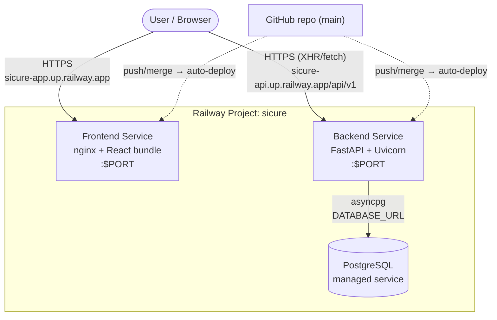
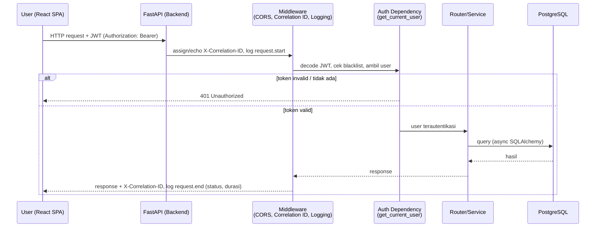
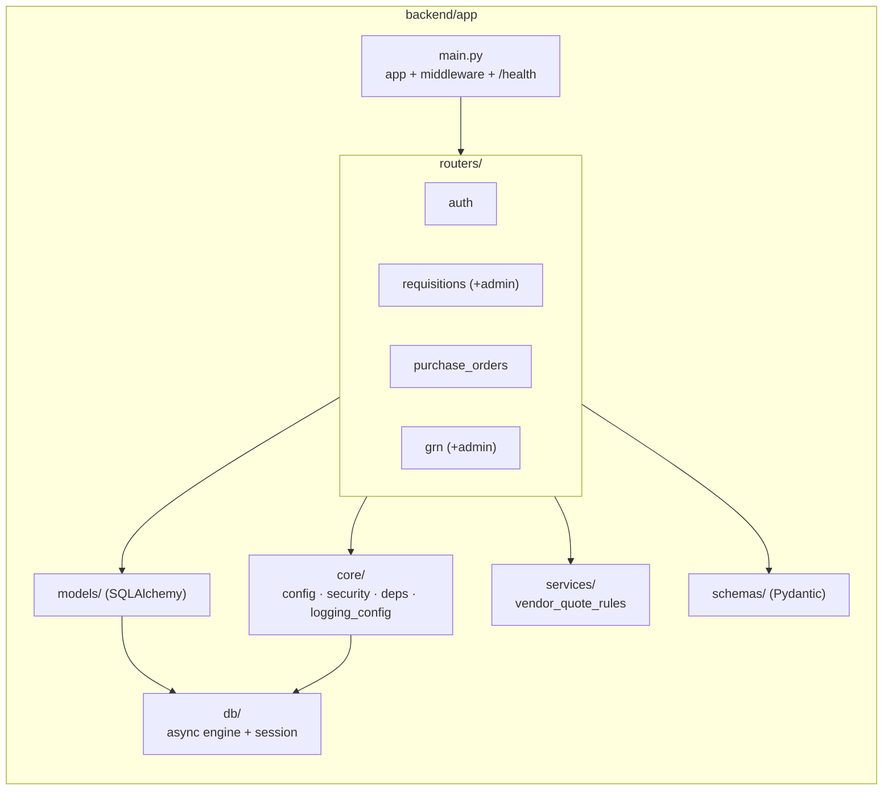
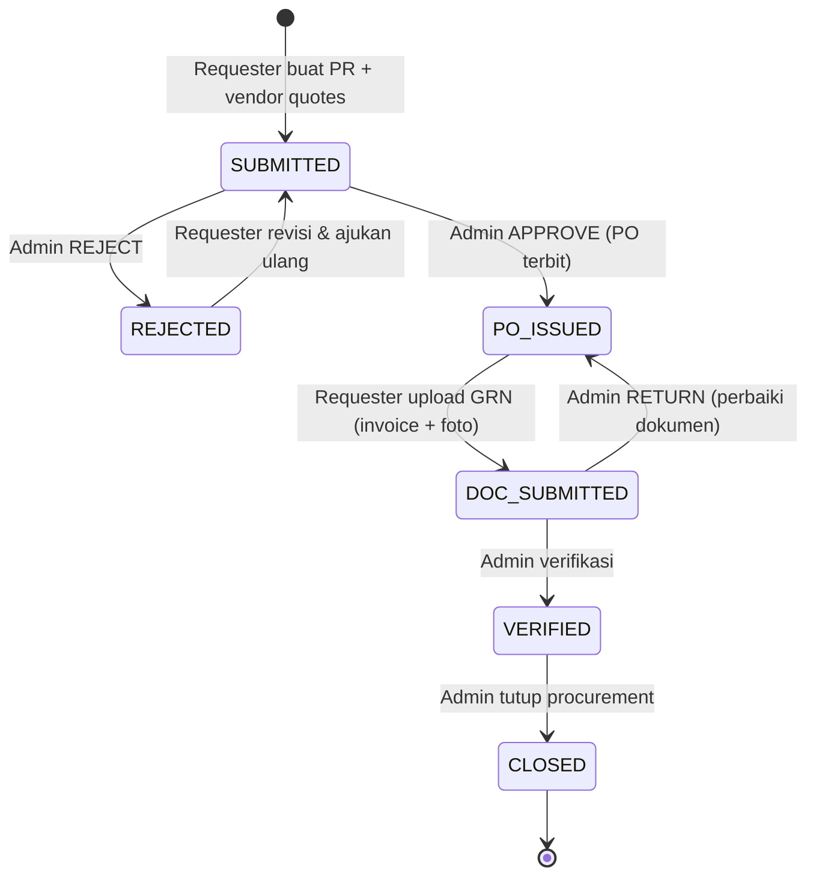
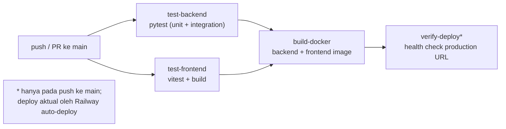
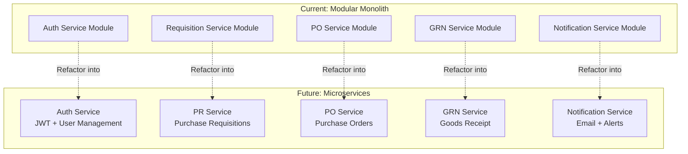
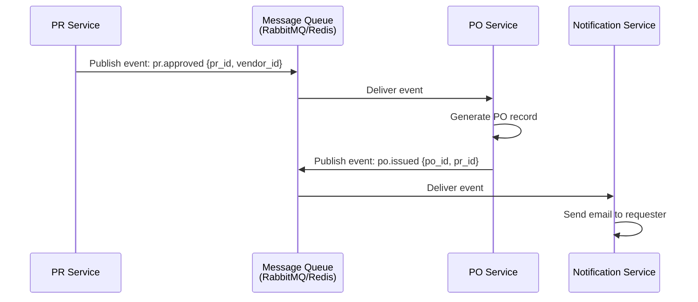

# System Architecture — SiCure

Dokumen ini menjelaskan arsitektur **aktual** SiCure yang berjalan saat ini:
aplikasi **monolith** (backend FastAPI + frontend React + PostgreSQL) yang
di-deploy ke Railway. Untuk catatan eksperimen microservices yang pernah
dilakukan, lihat [Release Notes](../release-notes.md).

> Stack: FastAPI + SQLAlchemy 2.0 (async) · React 19 + Vite · PostgreSQL 16 ·
> Docker · Railway (PaaS) · GitHub Actions (CI).

---

## 1. Deployment Architecture (Railway)

Satu Railway project berisi tiga service. Frontend dan backend masing-masing
punya domain publik; frontend memanggil backend langsung lewat `VITE_API_BASE_URL`
yang di-*bake* saat build.

Karakteristik:
- **Auto-deploy**: setiap merge ke `main`, Railway rebuild & redeploy kedua service.
- **Migrasi otomatis**: container backend menjalankan `alembic upgrade head` saat start.
- **Persistensi**: data tersimpan di PostgreSQL managed (bukan di filesystem container).

---

## 2. Request Flow (User → Gateway → Service → DB)

Poin penting:
- Setiap request mendapat **correlation ID** (di-generate atau diambil dari header
  `X-Correlation-ID`/`X-Request-ID`) yang muncul di seluruh log request tersebut.
- Endpoint terproteksi memakai dependency `get_current_user` / `require_role`,
  sehingga akses tanpa token valid ditolak `401`.

---

## 3. Component / Module View (Backend)

---

## 4. Procurement State Machine

Status sebuah Purchase Requisition (PR) selama siklus procurement:

---

## 5. CI/CD Pipeline

Detail langkah ada di [`.github/workflows/ci.yml`](../../.github/workflows/ci.yml)
dan panduan deploy di [railway-deployment.md](../railway-deployment.md).

---

## 5. Microservices Decomposition (Future Architecture)

Saat ini SiCure menggunakan **modular monolith** architecture — semua module dalam satu codebase tapi dengan clear separation of concerns. Jika sistem perlu scale atau tim berkembang, berikut adalah decomposition ke microservices yang direkomendasikan:

### Proposed Service Boundaries

### Service Decomposition Rationale

| Service | Responsibility | Database Schema | Communication |
|---------|---------------|-----------------|---------------|
| **Auth Service** | User registration, login, JWT issuance, token blacklist | `users`, `token_blacklist` | REST API for token validation |
| **PR Service** | Create/edit PR, vendor quote management, category filtering | `requisitions`, `line_items`, `vendor_quotes` | Events: `pr.submitted`, `pr.approved` |
| **PO Service** | Auto-generate PO from approved PR, vendor assignment | `purchase_orders` | Consumes: `pr.approved` event |
| **GRN Service** | Document upload, verification workflow, status tracking | `grn_records`, `grn_documents` | Consumes: `po.issued` event |
| **Notification Service** | Email notifications, status change alerts | `notifications`, `email_templates` | Consumes all domain events |

### Inter-Service Communication Patterns

**1. Synchronous (REST/gRPC)**
- Auth service expose endpoint `/validate-token` untuk service lain verify JWT
- PR service call Auth service untuk get user details by ID

**2. Asynchronous (Event-Driven via Message Queue)**

**3. Shared Database vs Database-per-Service**
- **Current:** Single PostgreSQL database dengan shared schema
- **Future:** Each service has own database schema, communicate via APIs/events
- **Challenge:** Distributed transactions (use Saga pattern untuk maintain consistency)

### Why We Chose Monolith First

1. **Team Size:** 5 orang → coordination overhead microservices tidak worth it
2. **Complexity:** Business logic belum cukup complex untuk justify service boundaries
3. **Deployment Simplicity:** Satu deployment unit lebih mudah manage di Railway
4. **Performance:** No network latency antara modules (in-process calls vs HTTP)
5. **Development Speed:** Faster iteration tanpa concern service versioning

### When to Migrate to Microservices

Migration justified ketika:
- ✅ Tim > 10 developers dengan multiple squads
- ✅ Different scaling requirements (misal: GRN upload butuh more resources)
- ✅ Independent deployment needs (tim frontend butuh release lebih sering)
- ✅ Technology diversity (misal: notification service better dengan Node.js)
- ✅ Fault isolation critical (satu service down tidak affect others)

### Current Modular Design Enables Future Migration

Codebase saat ini sudah structured untuk memudahkan future extraction:
- **Clear module boundaries:** `app/routers/`, `app/models/`, `app/services/` per domain
- **Dependency injection:** Services tidak hard-depend pada implementation details
- **Event-driven patterns:** Status transitions bisa easily convert ke events
- **API-first design:** External contracts sudah well-defined via Pydantic schemas

Ini berarti migration path jelas: extract module → create separate service → replace in-process calls dengan HTTP/event communication.
