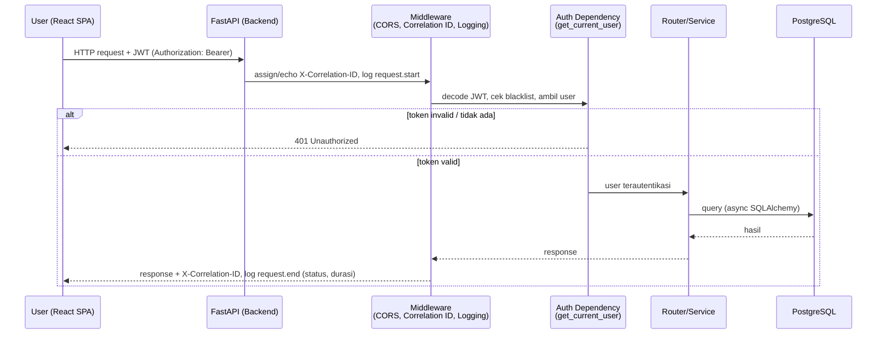
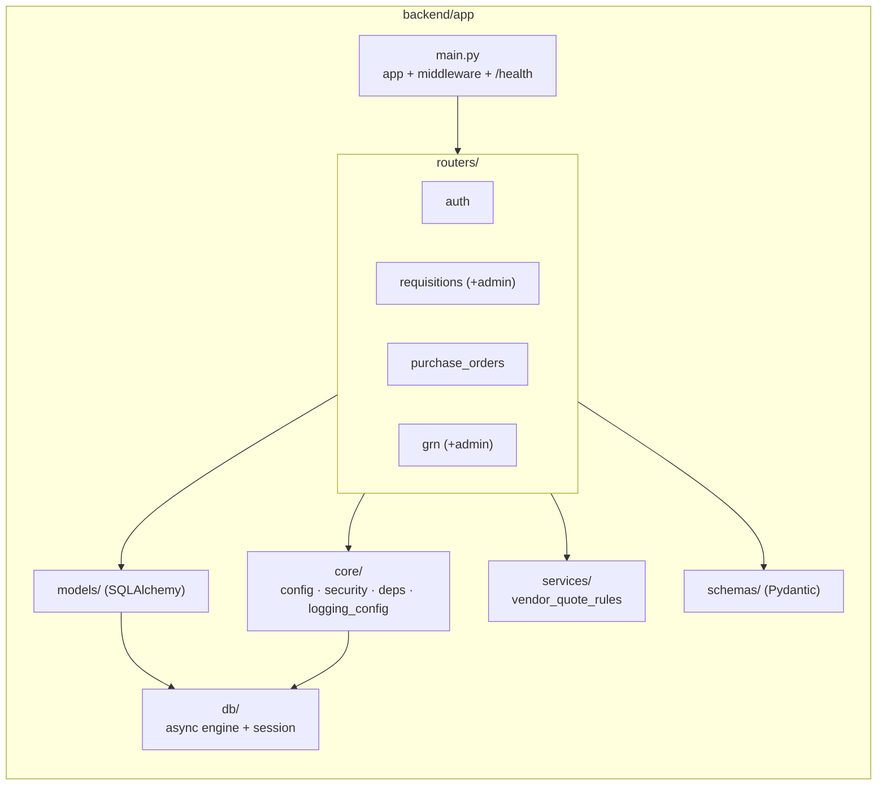
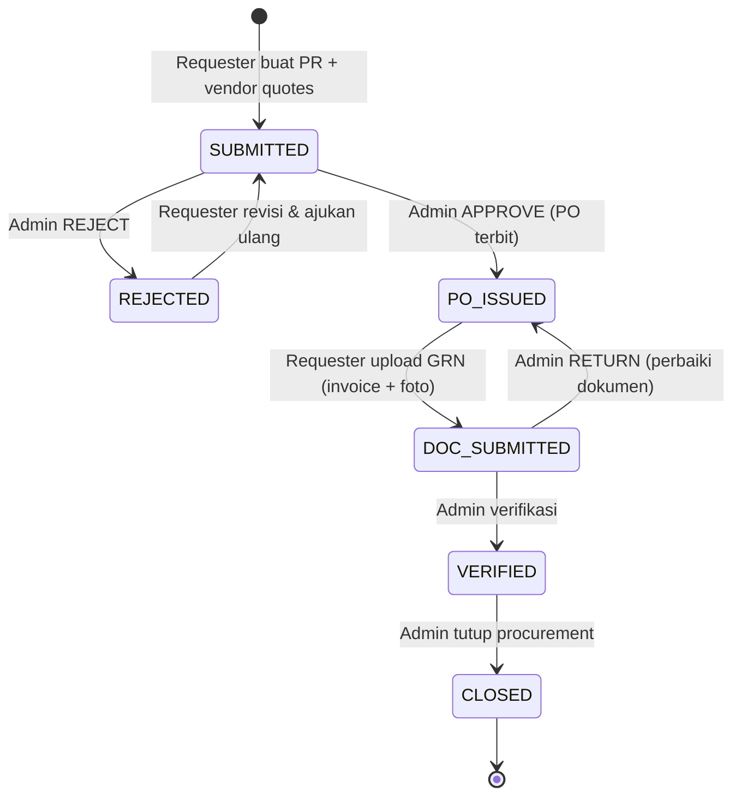
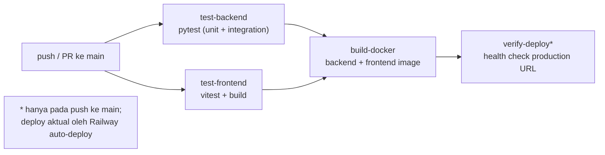

# System Architecture — SiCure

Dokumen ini menjelaskan arsitektur **aktual** SiCure yang berjalan saat ini:
aplikasi **monolith** (backend FastAPI + frontend React + PostgreSQL) yang
di-deploy ke Railway. Untuk catatan eksperimen microservices yang pernah
dilakukan, lihat [Release Notes](../release-notes.md).

> Stack: FastAPI + SQLAlchemy 2.0 (async) · React 19 + Vite · PostgreSQL 16 ·
> Docker · Railway (PaaS) · GitHub Actions (CI).

---

## 1. Deployment Architecture (Railway)

Satu Railway project berisi tiga service. Frontend dan backend masing-masing
punya domain publik; frontend memanggil backend langsung lewat `VITE_API_BASE_URL`
yang di-*bake* saat build.

Karakteristik:
- **Auto-deploy**: setiap merge ke `main`, Railway rebuild & redeploy kedua service.
- **Migrasi otomatis**: container backend menjalankan `alembic upgrade head` saat start.
- **Persistensi**: data tersimpan di PostgreSQL managed (bukan di filesystem container).

---

## 2. Request Flow (User → Gateway → Service → DB)

Poin penting:
- Setiap request mendapat **correlation ID** (di-generate atau diambil dari header
  `X-Correlation-ID`/`X-Request-ID`) yang muncul di seluruh log request tersebut.
- Endpoint terproteksi memakai dependency `get_current_user` / `require_role`,
  sehingga akses tanpa token valid ditolak `401`.

---

## 3. Component / Module View (Backend)

---

## 4. Procurement State Machine

Status sebuah Purchase Requisition (PR) selama siklus procurement:

---

## 5. CI/CD Pipeline

Detail langkah ada di [`.github/workflows/ci.yml`](../../.github/workflows/ci.yml)
dan panduan deploy di [railway-deployment.md](../railway-deployment.md).
