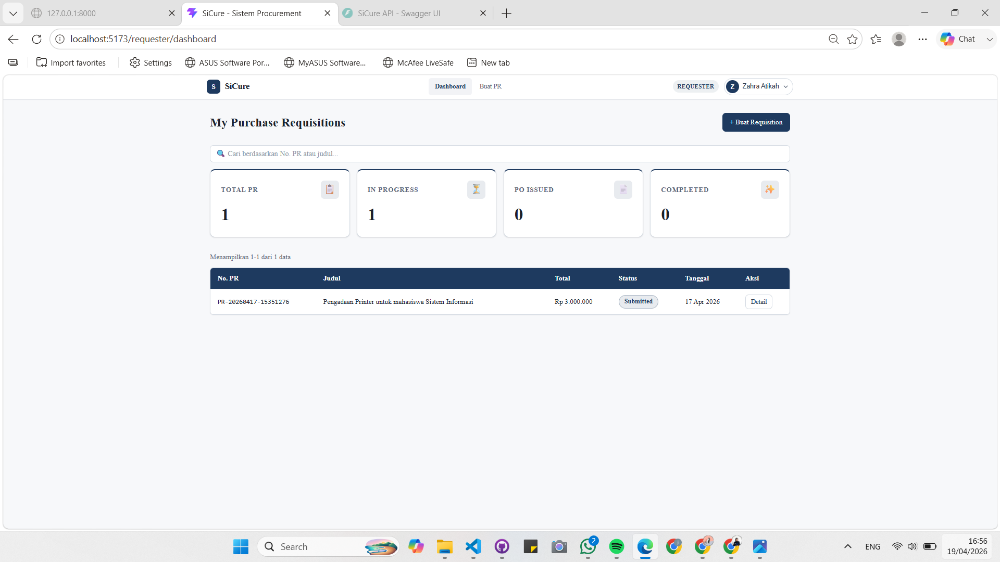
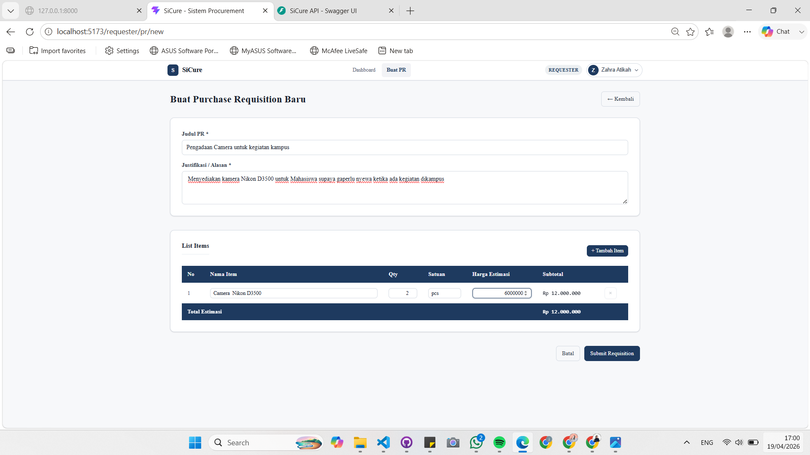
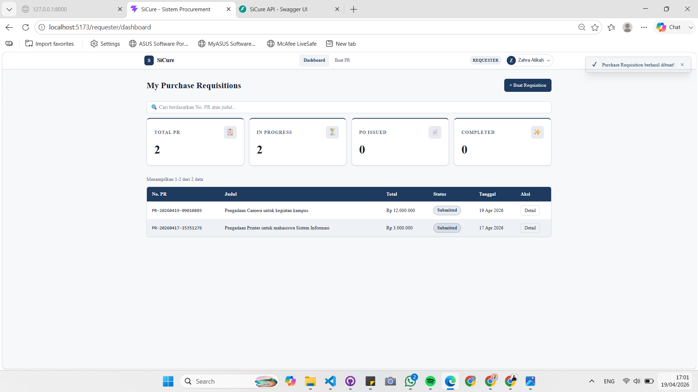
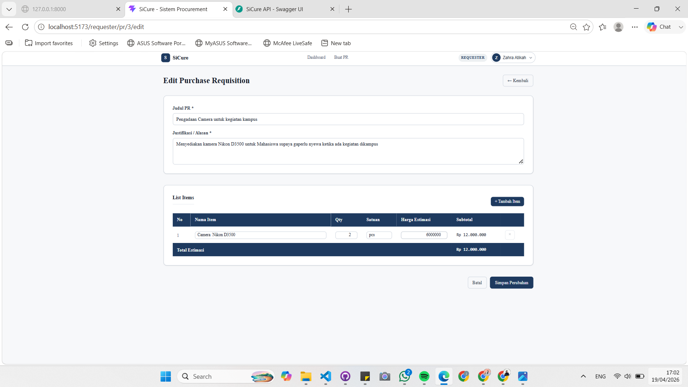
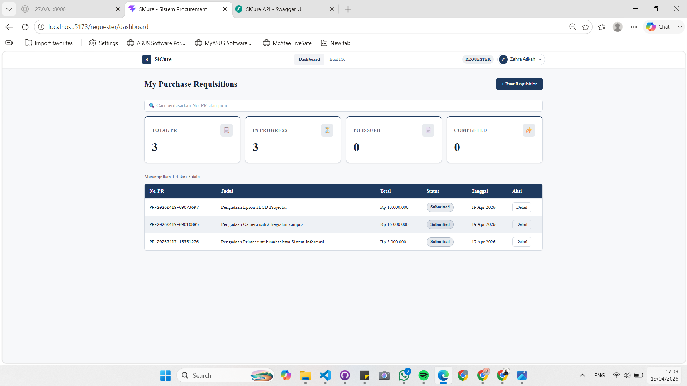
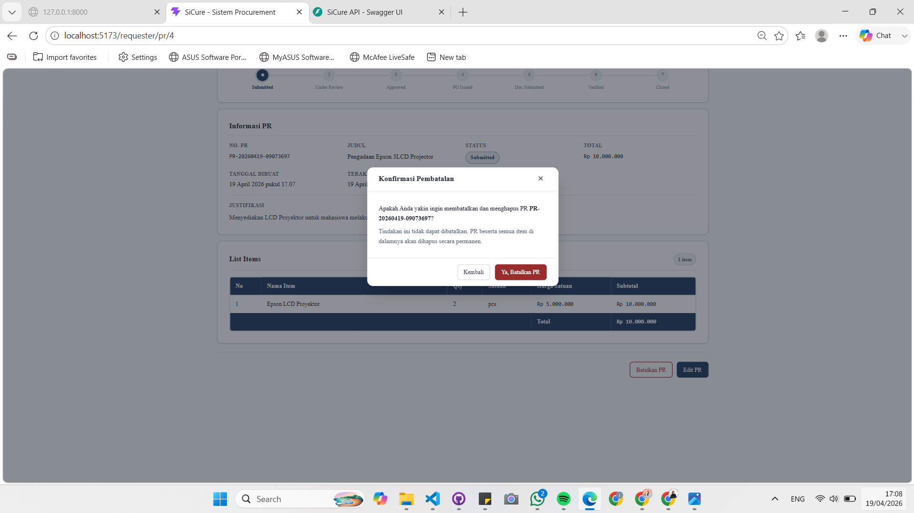
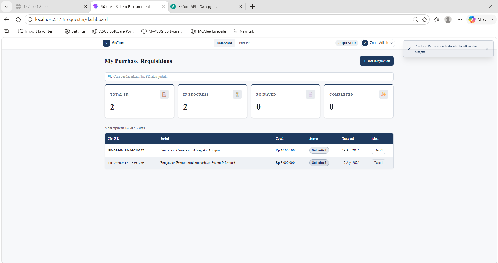
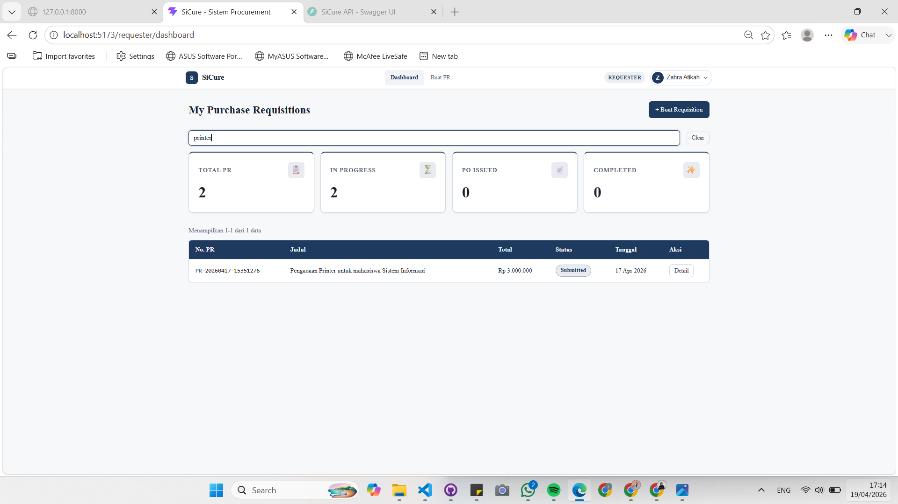
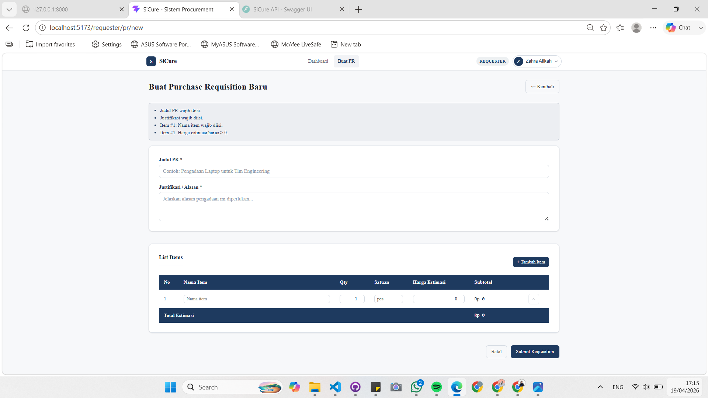
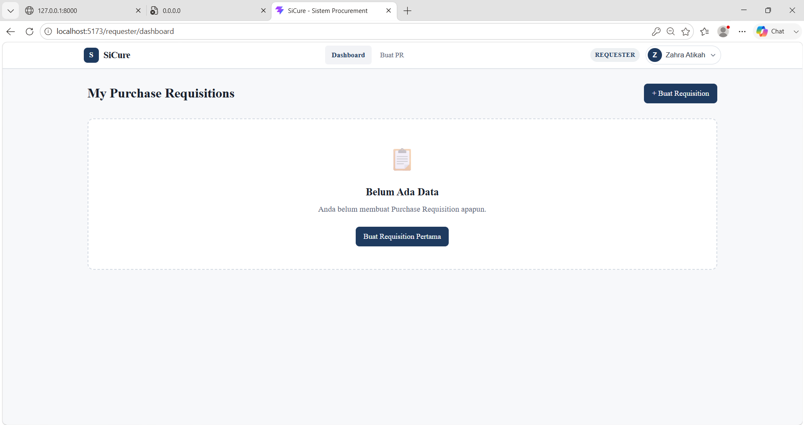

# 📋 UI TEST RESULT

## 1. Tampilan Halaman Utama (Dashboard) ✅

 

**Hasil Pengujian:**

Halaman utama (dashboard) aplikasi berhasil ditampilkan dengan baik pada browser. Sistem menampilkan data *Purchase Requisitions* yang diambil dari backend, seperti daftar PR, total PR, serta status (In Progress, Completed, dll).

Data yang muncul pada tabel menunjukkan bahwa frontend berhasil melakukan komunikasi dengan backend API untuk mengambil dan menampilkan data secara dinamis.

Selain itu, elemen UI seperti search bar, tombol *Buat Requisition*, dan ringkasan statistik juga tampil dengan normal, menandakan bahwa struktur komponen React telah berjalan sesuai dengan yang dirancang pada modul.

### Status
✅ **PASS**

**Kesimpulan:**
Frontend berhasil terhubung dengan backend, dibuktikan dengan data yang ditampilkan secara langsung pada halaman dashboard.

## 2. Tambah Purchase Requisition (CREATE) ✅

### A. Pengisian Form Requisition
 

**Hasil Pengujian:**
Pada tahap ini dilakukan pengujian fitur *Create* dengan mengisi form pembuatan *Purchase Requisition* baru. Data yang dimasukkan antara lain:
- **Judul PR:** Pengadaan Camera untuk kegiatan kampus
- **Justifikasi:** Kebutuhan unit kamera Nikon D3500
- **List Items:** Item kamera sebanyak 2 unit dengan harga estimasi Rp 6.000.000 per unit

Sistem secara otomatis menghitung **Total Estimasi** sebesar Rp 12.000.000 sebelum data dikirim. Hal ini menunjukkan bahwa perhitungan pada sisi frontend berjalan dengan baik.

---

### B. Konfirmasi Berhasil & Update List
 

**Hasil Pengujian:**
Setelah tombol *Submit Requisition* ditekan, data berhasil dikirim ke backend API. Hasil yang terlihat:
1. Muncul notifikasi sukses berupa *toast* dengan pesan **"Purchase Requisition berhasil dibuat!"**
2. Halaman otomatis kembali ke Dashboard
3. Data PR baru muncul di tabel dan jumlah pada bagian statistik ikut bertambah

### Status
✅ **PASS**

**Kesimpulan:**
Fitur **CREATE** berjalan dengan baik. Data berhasil dikirim ke backend dan langsung ditampilkan kembali di frontend, menandakan proses integrasi berjalan dengan lancar.

## 3. Edit Purchase Requisition (UPDATE) ✅

### A. Form Edit (Autofill Data)
 

**Hasil Pengujian:**
Pada tahap ini dilakukan pengujian fitur *Update* dengan menekan tombol edit pada salah satu data yang sudah ada. Sistem berhasil mengambil data berdasarkan ID dan menampilkannya kembali ke dalam form secara otomatis (*autofill*).

User kemudian melakukan perubahan pada bagian **Harga Estimasi** untuk item "Camera Nikon D3500", dari Rp 6.000.000 menjadi Rp 8.000.000, sehingga **Total Estimasi** ikut berubah menjadi Rp 16.000.000.

---

### B. Hasil Setelah Perubahan Disimpan
 

**Hasil Pengujian:**
Setelah menekan tombol **"Simpan Perubahan"**, data berhasil diperbarui di sistem. Hasil yang terlihat:
1. Data pada tabel dashboard berubah sesuai dengan hasil edit
2. Nilai pada kolom **Total** telah diperbarui menjadi Rp 16.000.000
3. Data lain tetap tidak terpengaruh

### Status
✅ **PASS**

**Kesimpulan:**
Fitur **UPDATE** berjalan dengan baik. Perubahan data berhasil disimpan di backend dan langsung ditampilkan kembali di frontend tanpa kendala.

## 4. Hapus Purchase Requisition (DELETE) ✅

### A. Modal Konfirmasi Hapus
 

**Hasil Pengujian:**
Pada tahap ini dilakukan pengujian fitur penghapusan data. Saat user menekan tombol "Batalkan PR" pada halaman detail, sistem tidak langsung menghapus data, tetapi menampilkan **modal konfirmasi** terlebih dahulu.

Hal ini menunjukkan bahwa sistem memberikan perlindungan agar data tidak terhapus secara tidak sengaja. Pada modal juga ditampilkan informasi nomor PR yang akan dihapus sebagai konfirmasi tambahan bagi user.

---

### B. Hasil Setelah Data Dihapus
 

**Hasil Pengujian:**
Setelah user menekan tombol **"Ya, Batalkan PR"**, data berhasil dihapus dari sistem. Hasil yang terlihat:
1. Muncul notifikasi sukses bahwa data berhasil dihapus
2. Data "Pengadaan Epson 3LCD Projector" sudah tidak muncul lagi di tabel dashboard
3. Jumlah pada bagian statistik seperti **Total PR** dan **In Progress** ikut berkurang

### Status
✅ **PASS**

**Kesimpulan:**
Fitur **DELETE** berjalan dengan baik. Data berhasil dihapus dari backend dan perubahan langsung terlihat pada tampilan frontend.

## 5. Fitur Pencarian (SEARCH) ✅

 

**Hasil Pengujian:**
Pada tahap ini dilakukan pengujian fitur pencarian pada dashboard. User memasukkan kata kunci **"printer"** pada search bar. Hasil yang terlihat:

1. Sistem berhasil menampilkan data yang sesuai dengan kata kunci yang dimasukkan
2. Data yang muncul relevan, yaitu "Pengadaan Printer untuk mahasiswa Sistem Informasi"
3. Jumlah data yang ditampilkan ikut menyesuaikan (misalnya menjadi 1 data)

### Status
✅ **PASS**

**Kesimpulan:**
Fitur **SEARCH** berjalan dengan baik. Sistem mampu menampilkan data sesuai pencarian sehingga memudahkan user dalam menemukan data yang dibutuhkan.

## 6. Validasi Form (ERROR HANDLING) ✅

 

**Hasil Pengujian:**
Pada tahap ini dilakukan pengujian untuk melihat bagaimana sistem menangani input yang tidak sesuai. User mencoba menekan tombol **"Submit Requisition"** tanpa mengisi field wajib dan membiarkan harga tetap 0. Hasil yang terlihat:

1. Sistem menampilkan pesan error pada bagian atas form
2. Pesan yang ditampilkan cukup jelas, seperti "Judul PR wajib diisi", "Justifikasi wajib diisi", dan "Harga estimasi harus > 0"
3. Data tidak bisa dikirim sebelum semua input sesuai dengan aturan

### Status
✅ **PASS**

**Kesimpulan:**
Fitur **Validasi Form** berjalan dengan baik. Sistem mampu mencegah input yang tidak valid sehingga data yang masuk tetap sesuai dan terjaga.

## 7. Tampilan Data Kosong (EMPTY STATE) ✅

 

**Hasil Pengujian:**
Pada tahap ini dilakukan pengujian tampilan saat tidak ada data pada sistem. Hasil yang terlihat:

1. Sistem menampilkan pesan **"Belum Ada Data"** sehingga user tidak melihat halaman kosong
2. Terdapat tombol "Buat Requisition Pertama" yang membantu user untuk mulai menambahkan data
3. Aplikasi tetap berjalan normal tanpa error meskipun tidak ada data yang ditampilkan

### Status
✅ **PASS**

**Kesimpulan:**
Fitur **EMPTY STATE** berjalan dengan baik. Sistem dapat menampilkan kondisi tanpa data dengan jelas sehingga tetap mudah dipahami oleh user.

## Kesimpulan Akhir

Berdasarkan hasil pengujian yang telah dilakukan, seluruh fitur utama seperti Create, Read, Update, Delete, Search, dan Validasi Form berjalan dengan baik. Sistem mampu menampilkan data, memproses input user, serta merespon setiap aksi tanpa kendala.

Secara keseluruhan, integrasi antara frontend dan backend telah berjalan dengan baik dan sesuai dengan yang diharapkan.