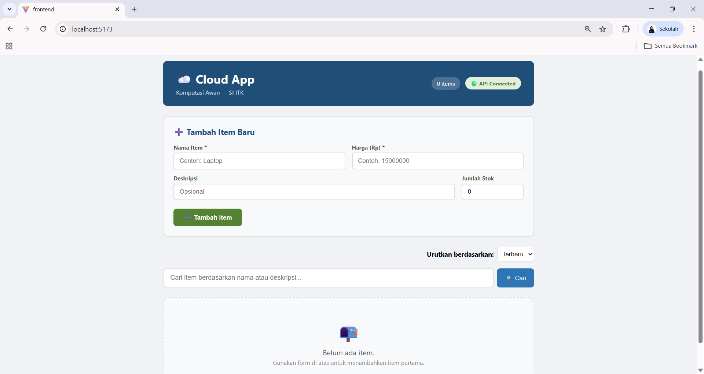
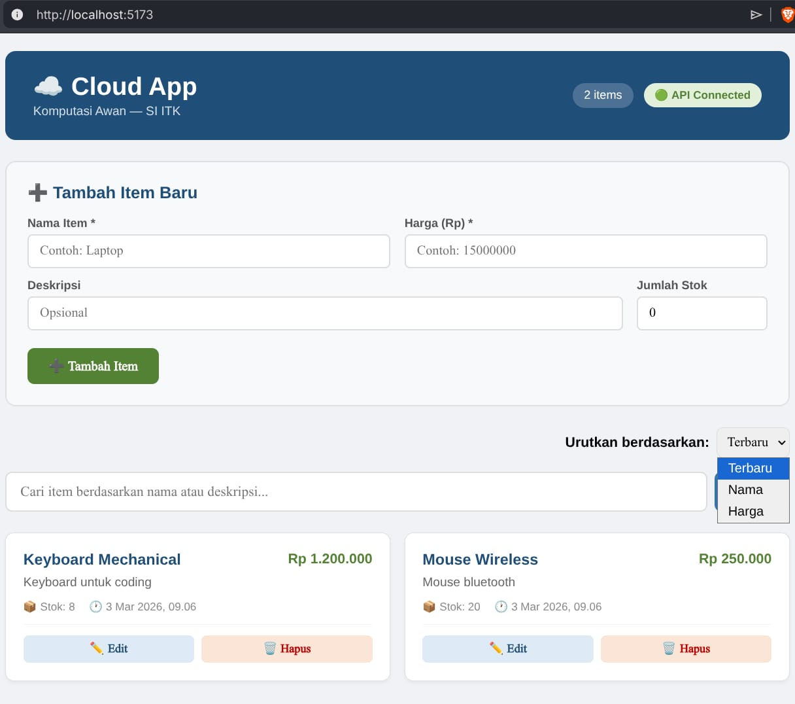
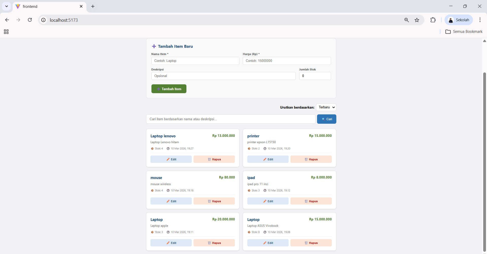
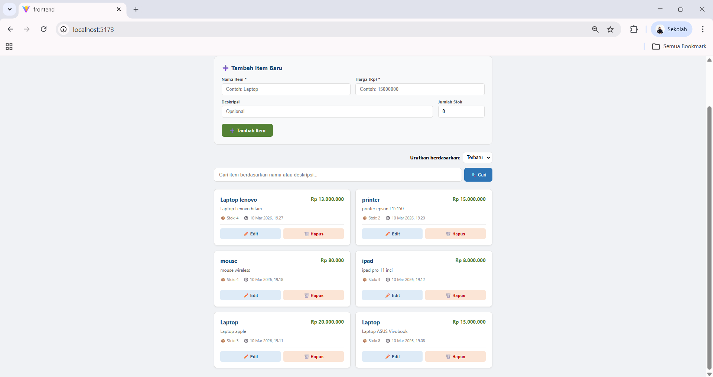
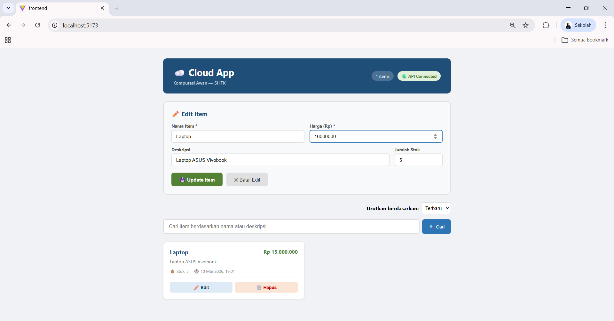
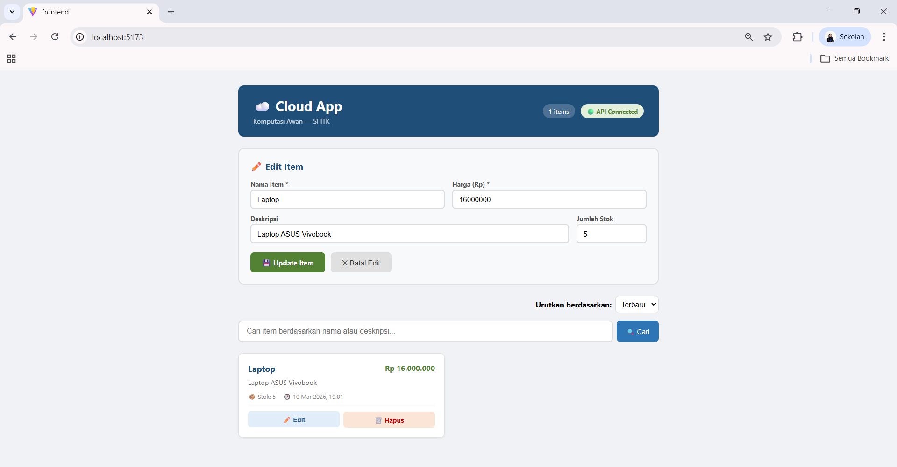
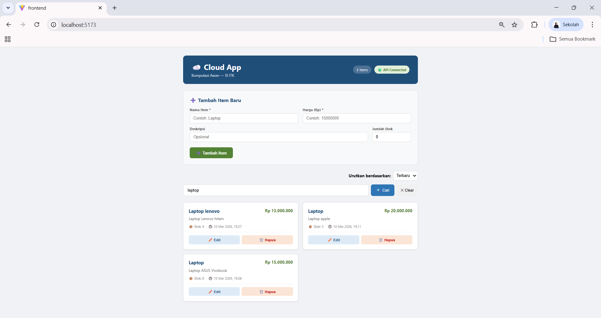
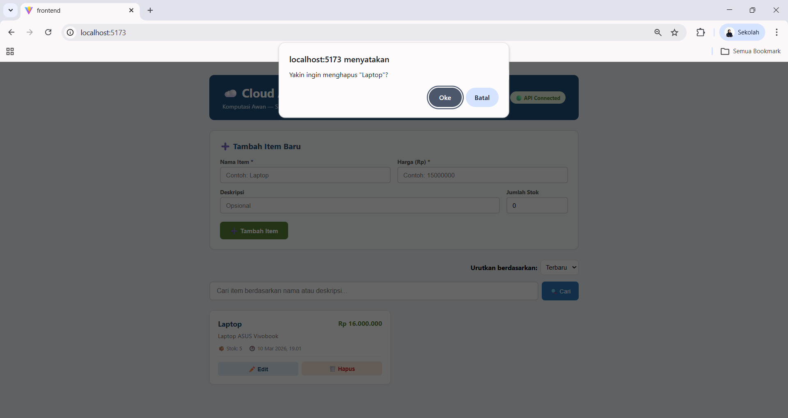
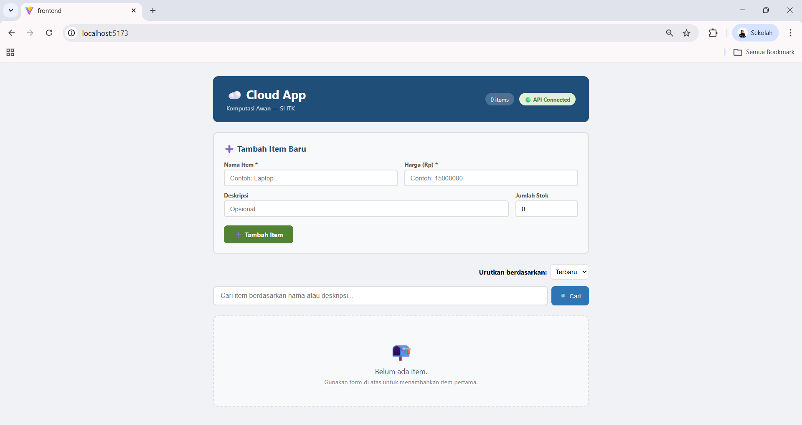
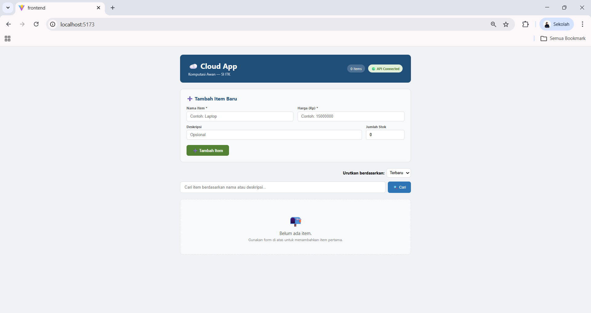

# UI Test Results – Modul 3 Komputasi Awan

## Test 1 – Memastikan API Terhubung dengan Frontend

### Tujuan Pengujian
Memastikan bahwa aplikasi frontend berhasil terhubung dengan backend API sehingga aplikasi dapat mengambil dan menampilkan data item.

### Langkah Pengujian
1. Menjalankan aplikasi frontend melalui browser dengan alamat `http://localhost:5173`.
2. Membuka halaman utama aplikasi Cloud App.
3. Memeriksa indikator status API pada bagian header aplikasi.

### Screenshot

### Hasil yang Diharapkan
- Aplikasi berhasil dimuat pada browser.
- Status koneksi API menunjukkan **API Connected**.
- Sistem dapat mengambil data dari backend.

### Hasil Pengujian
Pada halaman utama terlihat indikator **API Connected** yang menandakan bahwa frontend telah berhasil terhubung dengan backend API.

### Kesimpulan
Pengujian berhasil. Frontend dapat berkomunikasi dengan backend API dengan baik sehingga aplikasi dapat mengambil dan menampilkan data dari server.

---

## Test 2 – Menambahkan Item Baru

### Tujuan Pengujian
Memastikan bahwa pengguna dapat menambahkan item baru menggunakan form yang tersedia pada aplikasi.

### Langkah Pengujian
1. Mengisi form **Tambah Item Baru**.
2. Mengisi field yang tersedia seperti:
   - Nama Item
   - Harga
   - Deskripsi
   - Jumlah Stok
3. Menekan tombol **Tambah Item**.

### Screenshot

### Hasil yang Diharapkan
- Sistem menerima input data dari pengguna.
- Item baru berhasil disimpan ke database melalui API.

### Hasil Pengujian
Form penambahan item dapat digunakan dengan baik dan data item dapat dikirim ke backend API.

### Kesimpulan
Fitur penambahan item berjalan dengan baik dan data berhasil disimpan di sistem.

---

## Test 3 – Menampilkan Item pada Daftar

### Tujuan Pengujian
Memastikan bahwa item yang telah ditambahkan dapat ditampilkan dalam daftar item pada halaman utama.

### Langkah Pengujian
1. Menambahkan beberapa item menggunakan form yang tersedia.
2. Memeriksa daftar item yang ditampilkan pada bagian bawah halaman.

### Screenshot

### Hasil yang Diharapkan
- Item yang telah ditambahkan muncul pada daftar item.
- Informasi item ditampilkan dengan lengkap seperti nama, harga, deskripsi, dan stok.

### Hasil Pengujian
Beberapa item berhasil ditampilkan dalam bentuk card seperti Laptop Lenovo, Printer, Mouse, dan iPad. Setiap item menampilkan harga, stok, serta waktu pembuatan data.

### Kesimpulan
Sistem berhasil menampilkan data item yang tersimpan di database melalui API ke dalam tampilan frontend.

---

## Test 4 – Mengurutkan Item

### Tujuan Pengujian
Memastikan bahwa fitur pengurutan item dapat digunakan untuk mengatur tampilan daftar item.

### Langkah Pengujian
1. Membuka menu dropdown **Urutkan berdasarkan**.
2. Memilih salah satu opsi pengurutan seperti:
   - Terbaru
   - Nama
   - Harga
3. Mengamati perubahan urutan daftar item.

### Screenshot

### Hasil yang Diharapkan
- Sistem mengurutkan item sesuai dengan pilihan pengguna.
- Daftar item diperbarui secara otomatis.

### Hasil Pengujian
Dropdown pengurutan menampilkan beberapa pilihan yaitu Terbaru, Nama, dan Harga. Item ditampilkan sesuai dengan kriteria pengurutan yang dipilih.

### Kesimpulan
Fitur pengurutan item berjalan dengan baik dan membantu pengguna dalam mengelola daftar item.

---

## Test 5 – Mengedit Item

### Tujuan Pengujian
Memastikan bahwa pengguna dapat memperbarui informasi item yang telah ditambahkan.

### Langkah Pengujian
1. Memilih item dari daftar.
2. Menekan tombol **Edit** pada item tersebut.
3. Mengubah informasi item seperti harga atau deskripsi.
4. Menekan tombol **Update Item**.

### Screenshot

### Hasil yang Diharapkan
- Form edit item muncul dengan data yang sudah ada.
- Data dapat diperbarui dan disimpan kembali ke sistem.

### Hasil Pengujian
Form edit item muncul dan pengguna dapat mengubah data item. Setelah tombol update ditekan, perubahan data dapat disimpan.

### Kesimpulan
Fitur edit item berjalan dengan baik dan memungkinkan pengguna memperbarui data item dalam sistem.

---

## Test 6 – Memperbarui Data Item

### Tujuan Pengujian
Memastikan bahwa perubahan data item yang dilakukan melalui form edit dapat tersimpan dan diperbarui di sistem.

### Langkah Pengujian
1. Memilih salah satu item pada daftar item.
2. Menekan tombol **Edit** pada item tersebut.
3. Mengubah beberapa informasi item seperti harga atau deskripsi.
4. Menekan tombol **Update Item** untuk menyimpan perubahan.

### Screenshot

### Hasil yang Diharapkan
- Sistem menerima perubahan data dari pengguna.
- Data item yang telah diperbarui tersimpan ke database melalui API.
- Informasi item pada daftar diperbarui sesuai perubahan yang dilakukan.

### Hasil Pengujian
Form edit menampilkan data item yang sudah ada sebelumnya. Setelah pengguna mengubah data dan menekan tombol **Update Item**, perubahan berhasil disimpan dan data item pada daftar diperbarui.

### Kesimpulan
Fitur pembaruan data item berjalan dengan baik dan memungkinkan pengguna memperbarui informasi item yang tersimpan pada sistem.

---

## Test 7 – Mencari Item Menggunakan Search Bar

### Tujuan Pengujian
Memastikan bahwa fitur pencarian item dapat digunakan untuk menemukan item tertentu berdasarkan nama atau deskripsi.

### Langkah Pengujian
1. Mengisi kata kunci pada kolom **Cari item berdasarkan nama atau deskripsi**.
2. Menekan tombol **Cari**.
3. Mengamati hasil item yang ditampilkan pada daftar.

### Screenshot

### Hasil yang Diharapkan
- Sistem menampilkan item yang sesuai dengan kata kunci pencarian.
- Item yang tidak sesuai dengan kata kunci tidak ditampilkan.

### Hasil Pengujian
Setelah pengguna mengetik kata kunci **“laptop”** pada kolom pencarian, sistem menampilkan beberapa item yang memiliki nama atau deskripsi yang berkaitan dengan laptop.

### Kesimpulan
Fitur pencarian item berfungsi dengan baik dan membantu pengguna menemukan item dengan lebih cepat.

---

## Test 8 – Menghapus Item

### Tujuan Pengujian
Memastikan bahwa pengguna dapat menghapus item dari daftar yang tersimpan pada sistem.

### Langkah Pengujian
1. Memilih item yang ingin dihapus dari daftar.
2. Menekan tombol **Hapus** pada item tersebut.
3. Sistem menampilkan konfirmasi penghapusan.
4. Menekan tombol **OK** untuk menghapus item.

### Screenshot

### Hasil yang Diharapkan
- Sistem menampilkan konfirmasi sebelum item dihapus.
- Setelah dikonfirmasi, item dihapus dari database.
- Item tidak lagi muncul pada daftar item.

### Hasil Pengujian
Ketika tombol **Hapus** ditekan, sistem menampilkan konfirmasi penghapusan. Setelah pengguna menekan **OK**, item berhasil dihapus dan tidak lagi muncul pada daftar.

### Kesimpulan
Fitur penghapusan item berjalan dengan baik dan memungkinkan pengguna menghapus data item dari sistem.

---

## Test 9 – Memastikan Item Berhasil Dihapus dari Daftar

### Tujuan Pengujian
Memastikan bahwa item yang telah dihapus oleh pengguna benar-benar hilang dari daftar item pada halaman utama aplikasi.

### Langkah Pengujian
1. Memilih salah satu item dari daftar item yang tersedia.
2. Menekan tombol **Hapus** pada item tersebut.
3. Mengonfirmasi proses penghapusan ketika sistem menampilkan dialog konfirmasi.
4. Mengamati daftar item setelah proses penghapusan selesai.

### Screenshot

### Hasil yang Diharapkan
- Item yang dipilih berhasil dihapus dari sistem.
- Item tersebut tidak lagi muncul pada daftar item di halaman utama.
- Jumlah item pada aplikasi berkurang sesuai dengan item yang dihapus.

### Hasil Pengujian
Setelah tombol **Hapus** ditekan dan proses konfirmasi dilakukan, item berhasil dihapus dari sistem. Item yang sebelumnya terdapat pada daftar tidak lagi muncul pada tampilan aplikasi.

### Kesimpulan
Fitur penghapusan item berjalan dengan baik. Sistem berhasil menghapus data item dari database dan memperbarui tampilan daftar item pada frontend.

---

## Test 10 – Menampilkan Kondisi Ketika Tidak Ada Item (Empty State)

### Tujuan Pengujian
Memastikan bahwa sistem dapat menampilkan tampilan ketika tidak terdapat item yang tersimpan pada aplikasi.

### Langkah Pengujian
1. Menghapus seluruh item yang terdapat pada daftar item.
2. Membuka kembali halaman utama aplikasi.
3. Mengamati tampilan pada bagian daftar item.

### Screenshot

### Hasil yang Diharapkan
- Sistem menampilkan pesan bahwa belum ada item yang tersedia.
- Tampilan tetap informatif dan memberikan petunjuk kepada pengguna untuk menambahkan item baru.

### Hasil Pengujian
Setelah seluruh item dihapus, aplikasi menampilkan pesan **“Belum ada item. Gunakan form di atas untuk menambahkan item pertama.”** pada bagian daftar item.

### Kesimpulan
Tampilan kondisi tanpa data (empty state) berfungsi dengan baik. Sistem memberikan informasi yang jelas kepada pengguna bahwa belum terdapat data item serta mengarahkan pengguna untuk menambahkan item baru melalui form yang tersedia.

---

## Kesimpulan Pengujian

Berdasarkan hasil pengujian terhadap 10 skenario utama pada antarmuka aplikasi Cloud App, seluruh fitur utama sistem dapat berjalan dengan baik. Fitur yang diuji meliputi koneksi API, penambahan item, penampilan data, pengurutan item, pengeditan data, pembaruan data, pencarian item, penghapusan item, serta tampilan kondisi tanpa data (empty state).

Seluruh pengujian menunjukkan hasil sesuai dengan yang diharapkan. Hal ini menunjukkan bahwa integrasi antara frontend dan backend API berjalan dengan baik serta antarmuka aplikasi dapat digunakan dengan stabil oleh pengguna.

Dengan demikian, sistem dinyatakan **berhasil melewati pengujian UI pada Modul 3 Komputasi Awan** dan siap digunakan untuk tahap pengembangan selanjutnya.